# Java 11

- [Java SE 11 Programmer I](#Java-SE-11-Programmer-I)
- [Java SE 11 Programmer II](#Java-SE-11-Programmer-II)

## Java SE 11 Programmer I

- [Creating a Simple Java Program](#Creating-a-Simple-Java-Program)
- [Working With Java Primitive Data Types and String APIs](#Working-With-Java-Primitive-Data-Types-and-String-APIs)
- [Using Operators and Decision Constructs](#Using-Operators-and-Decision-Constructs)
- [Working with Java Arrays](#Working-with-Java-Arrays)
- [Describing and Using Objects and Classes](#Describing-and-Using-Objects-and-Classes)
- [Creating and Using Methods](#Creating-and-Using-Methods) 
- [Applying Encapsulation](#Applying-Encapsulation) 
- [Reusing Implementations Through Inheritance](#Reusing-Implementations-Through-Inheritance) 
- [Programming Abstractly Through Interfaces](#Programming-Abstractly-Through-Interfaces) 
- [Handling Exceptions](#Handling-Exceptions) 
- [Understanding Modules](#Understanding-Modules)
- [Understanding Java Technology and Environment](#Understanding-Java-Technology-and-Environment)

### Creating a Simple Java Program

1. A Java class is compiled using the **javac** program. Compilation results in one or more class files depending on the contents of the Java source file. An example is shown below:
    ```java
    javac TestClass.java
    ```

1. A Java class is executed using the **java** program. An example is shown below:
    ```java
    java TestClass a b c
    ```

1. The **Java Virtual Machine (JVM)** is an executable. When the JVM runs, it loads the given class and looks for the main method of that class to run. The executable for the JVM is named java.

1. Every Java class belongs to a package. There can be at most one package statement in the source file, and it must be the first statement in the file. If there is no package statement, then the classes defined in that file belong to an unnamed package which is known as the default package. Classes from other packages can be imported so that they can be referrred to without using the **Fully Qualified Class Name (FQCN)**. 

1. Java code is made up of expressions, statements and blocks. An expression is made up of variables, operators, and method invocations. An expression evaluates to a single value. An expression is something which evaluates a value, while a statement is a line of code that does something. Some expressions can be made into a statement by terminating it with a semicolon, such as assignment expressions, usage of ++ or --, method invocation and object creation expressions. A block is a group of zero or more statements between balanced brances and can be used wherever a single statement is allowed. 

1. The stack is used for storing local variables, function calls, and references to objects. The heap is used for storing objects.

### Working With Java Primitive Data Types and String APIs

1. Java is a statically typed language. This means that the data type of a variable is defined at compile time and cannot change during run time.

1. Java has primitive and reference variables. The Java compiler and JVM inherently know what primitive types mean, while reference data types are built by combining primitive data types and other reference data types.

1. Primitive data types are shown below:
    | Date Type | Size    | Description                                                             | Sample                  |
    |-----------|---------|-------------------------------------------------------------------------|-------------------------|
    | byte      | 1 byte  | -128 to 127                                                             | -1, 0, 1                |
    | short     | 2 bytes | -32,768 to 32,767                                                       | -1, 0, 1                |
    | int       | 4 bytes | -2,147,483,648 to 2,147,483,647                                         | -1, 0, 1                |
    | long      | 8 bytes | -9,223,372,036,854,775,808 to 9,223,372,036,854,775,807                 | -1, 0, 1                |
    | float     | 4 bytes | Stores fractional numbers. Sufficient for storing 6 to 7 decimal digits | 1.1f, 2.0f              |
    | double    | 8 bytes | Stores fractional numbers. Sufficient for storing 15 decimal digits     | 1.1d, 2.0d              |
    | boolean   | 1 bit   | Stores true or false values                                             | true, false             |
    | char      | 2 bytes | Stores a single character                                               | '\u0000', 'a'           |

1. Wrapper classes exist for Byte, Short, Integer, Long, Float and Double.

1. Reference types include:
    * Classes
    * Interfaces
    * Enums
    
1. A variable contains a raw number, and assigning one variable to another simply copies that number from one variable to another. Java uses **pass by value** semantics.

1. Java initialises all static and instance variables of a class automatically if you don't initialise them explicitly. You must initalise local variables explicitly before they are used.

1. Assigning a smaller type to a larger type is known as **implicit widening conversion** as no cast is required. To assign a larger type to a smaller type, for a compile time constant (i.e. final) the compiler will automatically narrow the value. If the source variable is not a constant then a cast is required, this is known as **explicit narrowing**. Determining the value that will actually be assigned when doing an explicit can be complicated.

1. A String is an object of class java.lang.String. String is a final class and implements java.lang.CharSequence. String is immutable so the value cannot be changed after instantiation.

1. A String can be instantiated using:
    ```java
    String myString = new String();
    String myString = new String("example");
    String myString = "example";
    String myString = new String(StringBuilder sb);
    String myString = new String(byte[] bytes);
    String myString = new String(char[] value);
    String myString = s1 + "add";
    ``` 

1. String concatenation can occur with the += operator if one of the operands is a String.

1. Strings created without using the new keyword are kept in the **string pool**. If a String is created without the new keyword and the same string already exists in the string pool, then a reference to the existing String will be returned.

1. Useful String methods include:
    ```java
    int length();
    char charAt(int index);
    int indexOf(int ch);
    String substring(int beginIndex, int endIndex);
    String substring(int beginIndex);
    String concat(String str);
    String toLowerCase();
    String toUpperCase();
    String replace(char oldChar, char newChar);
    String strip();
    String stripLeading();
    String stripTrailing();
    String trim();
    ```

1. Note that in the substring methods the ending index is exclusive, and the starting index is inclusive.

1. Useful methods for inspecting a String include:
    ```java
    boolean isBlank();
    boolean isEmpty();
    boolean startsWith(String prefix);
    boolean endsWith(String suffix);
    boolean contains(CharSequence s);
    boolean equals(Object anObject);
    boolean equalsIgnoreCase(String anotherString);
    ```

1. java.lang.StringBuilder is the mutable twin of java.lang.String. StringBuilder is also a final class and implements java.lang.CharSequence. StringBuilder is better suited for creating temporary strings that have no use once a method ends.

1. Stringbuilder provides several constructors:
    ```java
    StringBuilder();
    StringBuilder(CharSequence seq);
    StringBuilder(int capacity);
    StringBuilder(String str);
    ```

1. Note that the default size for the no argument constructor is 16 characters.

1. Useful StringBuilder methods include:
    ```java
    insert(int position, <X> value);
    append(<X> value);
    reverse();
    delete(int start, int end);
    deleteCharAt(int index);
    replace(int start, int end, String replacement);
    int capacity();
    char charAt(int index);
    int length();
    int indexOf(String str);
    int indexOf(String str, int startIndex);
    void setLength(int len);
    String substring(int start);
    String substring(int start, int end);
    String toString();
    ```
1. The value to append is typically determined by *String.valueOf()*.

### Using Operators and Decision Constructs

1. Arithmetic operators are used to perform standard mathematical operations on all primitive variables (and wrapper objects for numeric types) except boolean.

1. Operators and their precedence shown below:
    | Operator Type | Category             | Precadence                              |
    |---------------|----------------------|-----------------------------------------|
    | Unary         | postfix              | expr++ expr--                           |
    | Unary         | prefix               | ++expr --expr +expr -expr ~ !           |
    | Arithmetic    | multiplicative       | * / %                                   |
    | Arithmetic    | additive             | + -                                     |
    | Shift         | shift                | << >> >>>                               |
    | Relational    | comparison           | < > <= >= instanceof                    |
    | Relational    | equality             | == !=                                   |
    | Bitwise       | bitwise AND          | &                                       |
    | Bitwise       | bitwise exclusive OR | ^                                       |
    | Bitwise       | bitwise inclusive OR | \|                                      |
    | Logical       | logical AND          | &&                                      |
    | Logical       | logical OR           | \|\|                                    |
    | Ternary       | ternary              | ? :                                     |
    | Assignment    | assignment           | = += -= *= /= %= &= ^= \|= <<= >>= >>>= |

1. Java applies the rules of **numeric promotion** while working with operators that deal with numeric values. **Unary numeric promotion** occurs if an operand is smaller than int, and causes the operand to be automatically promoted to int. **Binary numeric promotion** occurs if one of the promoted operands is larger than int, and causes both operands to be promoted to the larger operand.

1. In the case of a Dangling Else statement, the Else is associated to the nearest if statement.

1. In a switch statement the expression must be:
    * Integral types (byte, char, short, int) and their wrapper classes. Note that this excludes long.
    * enum type.
    * A String.

1. In a switch statement case labels are optional, but if provided they must be compile time constants. If an enum is used the unqualifed enum constant (e.g. VALUE_A and not Class.MyEnum.VALUE_A) must be used.

1. In a switch statement the default block is optional, but if provided there can only be 1.

### Working with Java Arrays

1. Examples for array instantiation:
    ```java
    int[] ia = new int[10];
    int[] ia = {0, 1, 2, 3, 4, 5};
    int[][] iaa = new int[2][3];
    int[][] iaa = new int[3][];
    int[][] iaa = new int[][]{new int[]{1,2}};
    int[][] iaa = {{1,2}};
    ``` 

1. Members of an array object include:
    * length
    * clone

1. Arrays have two interesting runtime properties:
    * They are **reified** meaning that type checking is done at runtime by the JVM and not the compiler.
    * They are **covariant** meaning that a subclass object can be stored in  an array that is declared to be the type of its superclass (i.e. you can store an integer in a number array).

1. The compare method compares 2 int arrays and returns 0 if they are equal, a value less than 0 if the first array is lexicographically less than the second array, and a value greater than 0 if the first array is lexicographically greather than the second array.

1. The mismatch method takes two int arrays and returns the index of the first mismatch, otherwise it returns -1 if no mismatch is found.

### Describing and Using Objects and Classes

1. When an object is instantiated the JVM allocates the necessary heap space to contain the various fields defined in the class. An example of instantiation is shown below:
    ```java
    new java.lang.Object();
    ``` 

1. In Java if you don't specify any reference variable explicitly within any instance method, the JVM assumes that you mean to access the same object for which the method has been invoked. You can make this explicit with the **this** keyword.

1. The structure of a Java source file is:
    * At most one package statement.
    * Zero or more import statements.
    * One or more reference type (i.e. class, interface, or enum) definitions.

1. Members of a class definition include field declarations, methods, constructors, and initialisers. Members can be static or non-static.

1. The code for a top level public reference type must be written inside a Java file with the same name. 

1. Java has three **visibility scopes** for variables - class, method, and block. Java has five **lifespan scopes** for variables - class, instance, method, for loop, and block.

1. From Java 10 you can use a **var declaration** to infer types in a local method. An example is shown below:
    ```java
    var str = "Java 11";
    ```

1. If there are no more references to an Object, the JVM concludes that the object is not required anymore and is marked as **garbage**. The object is then removed using **garbage collection**.

### Creating and Using Methods

1. The basic structure of a method is shown below:
    ```java
    returnType methodName(parameters){
        methodBody
    ```

1. The method must return a value of the type specified, with the following exceptions:
    * If the type is numeric then the return value can be one of any other numeric type as long as the type of the return value is smaller than the declared type.
    * Wrapper classes and primitives are interchangable.
    * A subtype of the declared type can be returned (referred to as **covariant return**).

1. The method signature includes the method name and its ordered list of parameter types. Where multiple methods exist with the same name but different parameter types, it is said that the class has **overloaded** the method name.

1. If the type but not exact number of parameters is known, the varargs syntax can be used. This is represented by 3 dots after a data type. Restrictions on the usage of varargs are:
    * A method cannot have more than 1 varargs parameter.
    * The varargs parameter must be the last parameter in the parameter list.

1. The following rules used by the compiler to disambiguate method calls to overloaded methods:
    * A compilation error will occur if the compiler is not able to successfully disambiguate a particular method call.
    * If the compiler finds a method whose parameter list is an exact match to the argument list of the method call, that method is selected.
    * If more than one method is capable of accepting a method call and none of them are an exact match, the one that is most specific is chosen by the compiler.
    * Higher priority is given to primitive versions if the argument can be widened to the method parameter type, this occurs before autoboxing is considered.
    * Autoboxing is considered before varargs.

1. When a new instance of a class is created, the JVM does four things:
    * Checks if the class has been initialised, if not, loads and initialises the class.
    * Allocates the memory to hold the instance variables of the class in the heap space.
    * Initialises the instance variables to their default values.
    * Gives the instance an opportunity to set the values of the instance variables as per the instance initialisers and constructors.

1. An **instance initialiser** is shown below:
    ```java
    class TestClass{
        {
            System.out.println("In instance initialiser");
        }
    }
    ```

1. An instance variable is not allowed to use the value of a variable if that variable is declared below the initialiser. It can assign a value to such a variable. An instance initialiser is not expected to throw any exceptions. Instance initialisers should generally be avoided, and a well designed class should not need to use them.

1. A constructor is a method that always has the same name as the class, and does not have a return type.

1. A no argument constructor is defined by default only if no constructors are provided explicitly.

1. Constructors can be overloaded through **constructor overloading**. When a constructor calls another constructor of the same class, this is done with the **this** keyword and is called **constructor chaining**. The call to another constructor must be the first line of code in a constructor.

1. Java forces the programmer to assign a value to a final variable explicitly. A static variable can be used by other classes only after the class is loaded made ready to use. You can assign a value to a final static variable at the time of declaration or in any one of the **static initialisers**.

1. Access to static members is decided by the compiler at compile time by checking the declared type of the variable. This is referred to as **static binding**. Static binding uses type information to bind a method to a method call, as opposed to **dynamic binding** which takes into account the actual object.

1. The first step in creating an instance of a class is to initialise the class itself. Whenever the JVM encounters the usage of a class for the first time, it allocates and initialises space for the static fields of that class. The rules for static blocks:
    * A class can have any number of static blocks. They are executed in the order that they appear in the class.
    * A static block can access all static variables and static methods of the class. However, if the declaration of a static variable appears after the static block, then only the value can be set.
    * If the class has a superclass, and the superclass hasn't been initialised already, the JVM will initialise the superclass first.
    * There is no way to access or refer to a static block. It can only be invoked by the JVM, and only once.


### Applying Encapsulation

1. Encapsulation, Inheritance and Polymorphism are the three pillars of Object-Orientated Programming.

1. **Encapsulation** is about restricting direct access to an objects data fields. This is achieved through the use of **access modifiers**. Access modifiers and their impact on accessibility are shown below:

    | Modifier    | Class | Package | Subclass | World |
    |-------------|-------|---------|----------|-------|
    | public      | Y     | Y       | Y        | Y     |
    | protected   | Y     | Y       | Y        | N     |
    | no modifier | Y     | Y       | N        | N     |
    | private     | Y     | N       | N        | N     |

1. A top level class, interface or enum can only have a public or default access modifier.

1. Members of an interface are always public, even if not declared that way. The compiler will generate an error if you define them as private or protected. From Java 9 an interface can have private methods.

1. Enum constants are always public, even if not declared that way. The compiler will generate an error if you define them as private or protected. Enum constructors are always private.

1. Encapsulation encourages loose coupling between classes. If the functionality of a class is exposed through methods, there are two advantages:
    * The implementation can be modified without users being aware (i.e. the implementation details of the functionality are hidden from the users).
    * The value of a variable can be ensured to be consistant with the business logic of the class. For example you could restrict setting the age of a Person class instance from being a negative number.

### Reusing Implementations Through Inheritance

1. A class defines a type, and contains a state (the instance fields) and the implementation (the methods). Thus, inheritance could be of state, implementation, or type.

1. Java restricts a class from extending more than one class, so it is said that Java does not support multiple inheritance of state. A class can inherit implementation by extending a class and/or by implementating interfaces. As a class can implement multiple interfaces, Java supports multiple implementation inheritance. Java also supports multiple inheritance of type as an object can have multiple types: the type of its own class and the types of all the interfaces that the class implements. 

1. To inherit features from another class, that class is extended using the **extends** keyword. Constructors, static and instance initialisers of a class are not considered members of a class so are not inherited by a subclass. Only class members that are visible to another class as per the rules of access modifiers are inherited in a subclass.

1. Note that when the JVM initialises a class, memory is allocated for all instance variables irrespective of whether they will be accessible.

1. A subclass cannot be initialised before its parent. A call to *super()* is automatically inserted by the compiler in the first line of the constructor if no other call is provided.

1. The order of initialisation for loading a class is summarised below:
    * If there is a super class, initialise static fields and execute static initialisers of the super class in the order of their appearance.
    * Initialise static fields and execute static initialisers of the class in the order of their appearance.
    * If there is a super class, initialise the instance fields and execute instance initialisers of the super class in the order of their appearance.
    * Execute the super class's constructor.
    * Initialise the instance fields and execute instance initialisers of the class in the order of their appearance.
    * Execute class constructor.

1. An **abstract class** is used to capture common features of multiple related object types while knowing that no object that exhibits only the feature captured in the abstract class can actually exist.

1. An **abstract method** allows you to capture declaration without providing implementation.

1. A summary of the application of access modifiers, final, abstract and static keywords is shown below:
    * An abstract class doesn't have to have an abstract method but if a class has an abstract method, it must be declared abstract. In other words, a concrete class cannot have an abstract method.
    * An abstract class cannot be instantiated irrespective of whether it has an abstract method or not.
    * A final class or a final method cannot be abstract.
    * A final class cannot contain an abstract method but an abstract class may contain a final method.
    * A private method is implicitly final.
    * A private method can never be abstract.
    * A static method can be final but can never be abstract.

1. The conventional sequence of modifiers in a method declaration is shown below:
    ```java
    <access modifier> <static> <final or abstract> <return type> methodName(<parameter list>)
    ```

1. **Polymorphism** refers to the ability of an object to exhibit behaviour associated with different types. The objective of polymorphism is to enable classes to become standardised components that can be easily exchanged without any impact on other components.

1. Polymorphism works because of **dynamic binding** of method calls. When you invoke an instance method using a reference variable, it is not the compiler but the JVM that determines which code to execute based on the class of the actual object referenced by the variable. In Java, calls to non-private and non-final instance methods are dynamically bound. Everything else is **statically bound** at compile time by the compiler.

1. Static methods, static variables, and instance variables are accessed as per the declared type of the variable through which they are accessed and not according to the actual type of the object to which the variable refers. Contrast this with methods, where the actual type of the object determines which instance method is used.

1. A class is allowed to completely replace the behaviour of an instance method that it inherited by providing its own implementation of that method. This is known as **overriding**. The rules for overriding a method are shown below:
    * An overriding method must not be less accessible than the overriden method.
    * The return type of the overriding method must be a covariant return of the overridden method.
    * The types and order of the parameter list must be exactly the same.
    * An overriding method cannot put a wider exception in its throws clause than the ones present in the throws clause of the overriden method.

1. A class can **hide** static methods and variables and instance variables. Basically, static methods are hidden, non-static methods are overriden.

1. The purpose of casting is to provide the compiler with the type information of the actual object to which a variable will be pointing at run time. When you cast a reference to another type, you are basically saying that the program does something that is not evident from the code itself. Ideally, you should never need to use casting.

1. The instanceof operator can be used to check if an object is an instance of a particular reference type. An example is shown below:
    ```java
    if(f instanceof Mango){
    }
    ```

### Programming Abstractly Through Interfaces

1. An **interface** is used to describe behaviour as captured by a group of objects. An example is shown below:
    ```java
    interface Movable{
        void move(int x);
    }
    ```

1. From an OOP perspective an interface should not contain any implementation. It should only contain method declarations. However, Java allows interfaces to contain static fields as well as default, static and private methods.

1. Key rules for interfaces are shown below:
    * Members of an interface are always public, even if not declared that way. The compiler will generate an error if you define them as private or protected. From Java 9 an interface can have private methods.
    * An interface is always abstract.
    * All variables are implicitly public, static and final. Static methods are assumed to be public if not otherwise marked. Non-static methods must be explicitly marked private or default.

1. Methods that interfaces can contain are shown below:
    * **Abstract methods:** Contain only declarations. An example is shown below:
        ```java
        interface Movable{
            void move(int x); // implicitly abstract
            abstract void move2(int x); // explicitly abstract
        }
        ```

    * **Default methods:** The opposite of abstract, a method cannot be both default and abstract. An example is shown below:
        ```java
        interface Movable{
            default move(int x){
                System.out.println("Moving by "+x+" points");  
            }
        }
        ```

    * **Static methods:** Can be public or private but not protected or default. This is because static methods are not inherited or overridden in any meaningful way, and because protected methods can be seen by classes in the same package and which extend the class containing the method. However, a static method cannot be inherited so the package-private access modifier should be used instead of protected, as the only remaining intention is for it to be accessible within the same package. If no access modifier is specified, they are implicitly public. An example is shown below:
        ```java
        interface Movable{
            static void sayHello(){
                System.out.println("Hello!");  
            }
        }
        ```

    * **Private methods:** Helpful when methods get too big and need to be refactored into smaller internal methods. An example is shown below:
        ```java
        interface Movable{
            private void moveInternal(){
                System.out.println("in moveInternal");  
            }
            default void move(int n){
                while(n-->0) moveInternal();
            }
        }
        ```

1. An empty interface is known as a **marker interface**. The most common marker interface used in Java is java.io.Serializable. It signifies to the JVM that objects of classes implementing this interface can be serialised and deserialised.

1. A class can implement any number of interfaces. Once a class declares that it implements an interface, it must have an implementation for all of the abstract methods declared in that interface. Implementation could be inherited from an ancestor class. If the class does not have implementation for even one of the methods, the class must be declared abstract. An example is shown below:
    ```java
    interface Movable{
        void Move();
    }

    interface Readable{
        void read();
    }

    class Price implements Movable, Readable{
        public void move(){
            System.out.println("Moving...");
        }
        public void read(){
            System.out.println("Reading...");
        }
    }
    ```

1. Unlike the static methods of a class, the static methods of an interface cannot be inherited. Multiple fields with the same name can be inherited as long as they are not used ambiguously.

1. An interface can extend any number of interfaces. The extending interface inherits all members except static methods of each of the extended interfaces.

1. An interface defines behaviour. An interface tells you nothing about the actual object other than how it behaves. An abstract class defines an object which in turn drives the behaviour.

1. An ArrayList is a class that implements java.util.List, which in turn extends java.util.Collection.

1. A **parametrised** class uses a type parameter instead of the data type. An example is shown below:
    ```java
    public class DataHolder<E>{
        E data;
        public E getData() { return data; }
        public void setData(E e){ data = e; }
    }

    public class SomeClass<E>{
        public static void consumeData(DataHolder<String> stringData){
            String s = stringData.getData(); // no cast required
        }
    }
    ```

1. This allows a class to be written in a generic fashion, without hardcoding it to any particular type. This also allows that class to be typed to any type as per the requirement at the time of use.

1. A parametrised method is similar to a parametrised class. The only difference is that the type parameter is valid only for that method instead of the whole class.

1. All generic information is stripped at run time, this is known as **type erasure**. This means that the presence of generics can throw up complicated situations with respect to Overloading and Overriding.

1. The java.util.Collection interface is the root interface in the collection heirarchy. The java.util.List interface defines the behaviour of collections that keep objects in an order. The functionality is implemented by classes such as ArrayList and LinkedList.

1. Useful List methods are shown below:
    ```java
    E get(int index);
    E set(int index, E e);
    boolean add(E e);
    void add(int index, E e);
    boolean addAll(Collection<? extends E> c);
    void addAll(int index, Collection<? extends E> c);
    E remove(int index);
    boolean remove(Object obj);
    boolean removeAll(Collection<?> c);
    boolean retainAll(Collection c);
    void clear();
    int size();
    default void forEach(Consume<? super T> action);
    boolean isEmpty();
    boolean contains(Object o);
    boolean containsAll(Collection c);
    List subList(int fromIndex, int toIndex);
    int indexOf(Object o);
    int lastIndexOf(Object o);
    Object[] toArray();
    <T> T[] toArray(T[] a);
    ```

1. The of and copyOf methods take 0 to 10 parameters and return an unmodifiable list.

1. ArrayList constructors are shown below:
    ```java
    ArrayList();
    ArrayList(Collection c);
    ArrayList(int initialCapacity);
    ```

1. Advantages of ArrayList over an array include dynamic sizing, type safety, and readymade features. Disadvantages of ArrayList over an array include higher memory usage, no type safety, and no support for primitive values.

1. The java.util.HashMap class implements the java.util.Map interface. Map does not extend the Collection interface. Useful Map methods are shown below:
    ```java
    V get(Object key);
    V put(K key, V value);
    V remove(Object key);
    Set<K> keySet();
    Collection<V> values();
    void clear();
    int size();
    default void forEach(BiConsumer<? super K, ? super V> action);
    ```

1. A **lambda expression** is a shortcut for the compiler that defines a class with a method and instantiates that class. The below is an example of a class that implements a car shop:
    ```java
    class Car {
      String company;
      int year;
      double price;
      String type;
    
      Car(String c, int y, double p, String t) {
        this.company = c;
        this.year = y;
        this.price = p;
        this.type = t;
      }
    
      public String toString() {
        return "(" + company + "" + year + ")";
      }
    }
    
    class CarMall {
      List<Car> cars = new ArrayList<>();
    
      CarMall() {
        cars.add(new Car("Honda", 2012, 9000.0, "HATCH"));
        cars.add(new Car("Honda", 2018, 17000.0, "SEDAN"));
        cars.add(new Car("Toyota", 2014, 19000.0, "SUV"));
        cars.add(new Car("Ford", 2014, 13000.0, "SPORTS"));
        cars.add(new Car("Nissan", 2017, 8000.0, "SUV"));
      }
    
      List<Car> showCars(CarFilter cf) {
        ArrayList<Car> carsToShow = new ArrayList<>();
        for (Car c : cars) {
          if (cf.showCar(c))
            carsToShow.add(c);
        }
        return carsToShow;
      }
    }
    
    interface CarFilter {
      boolean showCar(Car c);
    }
    ```
1. The showCars method returns a list of cars based on any given criteria. By accepting an interface as an argument, the showCars method lets the caller decide the criteria for the search. TestClass below represents a third party class that uses CarMall: 
    ```java
    public class TestClass {
        public static void main(String[] args) {
        CarMall cm = new CarMall();
        CarFilter cf = new CompanyFilter("Honda");
        List<Car> carsByCompany = cm.showCars(cf);
        System.out.println(carsByCompany);
        }
    }

    class CompanyFilter implements CarFilter {
      private String company;
    
      public CompanyFilter(String c) {
        this.company = c;
      }
    
      public boolean showCar(Car c) {
        return company.contentEquals(c.company);
      }
    }
    ```

1. Observe that the above implementation of CarFilter can be replaced with the below:
    ```java
    public class TestClass {
        public static void main(String[] args) {
            CarMall cm = new CarMall();
            List<Car> carsByCompany = cm.showCars(c -> c.company.contentEquals("Honda"));
            System.out.println(carsByCompany);
        }
    }
    ```

1. The compiler knows that the showCars method must pass an object of a class that implements CarFilter. As a result it is easy to generate the below:
    ```java
    class XYZ implements CarFilter{
        public boolean showCar(Car <<parameterName>>){
            return <<an expression that returns a boolean>>;
    }
    ```

1. The parameterName and expression are contained wtihin the lambda expression.

1. A lambda expression can be written only where the target type is an interface with exactly one abstract method. Such an interface is known as a **functional interface**.

1. The syntax for a lambda expression is the variable declarations on the left side of the arrow operator and the right side for the code that you want execution.

1. Multiple lines of code must be written within curly braces. Parameter options are shown below:
    ```java
    () -> true // no parameter
    a -> a*a // 1 parameter
    (a) -> a*a // 1 parameter
    (int a) -> a*a // 1 parameter
    (a, b, c) -> a + b + c // multiple parameters
    (var a) -> a*a // var is also allowed
    ```

1. Filtering a list of objects is so common that Java provides a generic interface java.util.function.Predicate for this purpose. This is shown below:
    ```java
    interface Predicate<T>{
        boolean test(T t);
    }
    ```

1. This allows us to remove the CarFilter interface in the above example:
    ```java
    List<Car> showCars(Predicate<Car> cp) {
      ArrayList<Car> carsToShow = new ArrayList<>();
      for (Car c : cars) {
        if (cp.test(c)){
          carsToShow.add(c);
        }
      }
      return carsToShow;
    }
    ```
1. Other methods for the Predicate interface are shown below:
    ```java
    default Predicate<T> and(Predicate<? super T> other);
    default Predicate<T> negate();
    default Predicate<T> or(Predicate<? super T> other);
    static <T> Predicate<T> isEqual(Object targetRef);   
    ```
1. The Predicate interface is an example of a functional interface. They are called functional interfaces because they represent a single function and are for doing exactly one thing.

### Handling Exceptions

1. Java **exceptions** are designed to help you write code that covers all possible execution paths. This includes normal operations, exceptional situations and unknown exceptional situations. This is shown below:
    ```java
    try{    
        // code for normal course of action
    } catch(SecurityException se) {
        // code for known exceptional situation
        System.out.println("No permission!");
    }
    catch(Throwable t) {
        // code for unknown exceptional situations
        System.out.println("Some problem in copying: "+t.getMessage());
        t.printStackTrace();
    }
    ```

1. When developing code there is always the provider and the client. Exceptions are a means for the provider to let the client know about any exceptional events, and allow the client to determine how they want to deal with them. The mechanism to let the client know is to **throw** an exception. An example is shown below:
    ```java
    public void copyFile(String inputPath, String outputPath) throws IOException {
        // code to copy file
    }
    ```

1. If the client can resolve the situation a **catch** statement can be used. If the client cannot handle the exceptional situation either, the exception can be propogated to the client's client. An exception is considered handled when it is caught in a catch block.

1. The throw statement is used to explicitly throw an exception. Throwing an exception implies that the code has encountered an unexpected situation with which it does not want to deal. Java requires that you list the exceptions that a method might throw in the throws clause of that method. This is shown below:
    ```java
    public double computeSimpleInterest (double p, double r, double t) throws Exception{
        if(t<0) {
            throw new IllegalArgumentException("time is less than 0");
        }
        // other code
    }
    ```

1. A **try statement** provides an opportunity to recover from an exceptional situation that arises while executing a block of code.
    ```java
    try {
        // code that might throw exceptions
    } catch(<ExceptionClass1> e1){
        // code to execute if code in try throws exception 1
    } catch(<ExceptionClass2> e2){
        // code to execute if code in try throws exception 2
    } catch(<ExceptionClassN> en){
        // code to execute if code in try throws exception N
    } finally{
        // code to execute after try and catch blocks finish execution
    }
    ```

1. The java.lang.Throwable class is the root of all exceptions.   A Throwable object includes the chain of the method calls that led to the exception (known as the "stack trace") and any informational message specified by the programmer.

1. The Throwable heirarchy is shown below:
    

1. Generally **checked exceptions** are those that extend java.lang.Throwable but do not extend java.lang.RuntimeException or java.lang.Error. The remaining exceptions are **checked exceptions**. Checked exceptions must be declared in the throws clause of the method, or caught in a catch block within the method.

### Understanding Modules

1. JAR files are used to package multiple classes into a file and deliver the file as an application to users. A JAR file is a zip file with a special directory named META-INF. This directory contains one or more files with MAINIFEST.MF always being one of them. The manifest contains extra information about the JAR file such as the version of Java used to build the file, and the class with the *main()* method. Each line in the manifest is a key/value pair seperated by a colon.

1. Packaging classes into a JAR file without a well thought out plan can give rise to unwieldy applications that are difficult to update and/or reuse. JAR files also make it difficult to use part of an application without having the whole set of JAR files. Various Java community projects such as Ant, Maven, and Graven have attempted to provide a way of managing these issues.

1. In Java 9 the Java Module System was introduced to assist with these problems. The idea of Modules is that classes are mixed and matched at run time to form an application. 

1. A module is declared using the module-info.java file. By convention, this file is placed in a folder with the same name as the module name. An example of the contents of this file is shown below:
    ```java
    module simpleinterest{
    }
    ```

1. An example of the file structure for a module shown below:
    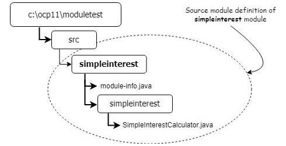

1. The module is compiled using the below:
    ```java
    javac -d out --module-source-path src --module simpleinterest
    ```

1. The above command used 3 switches. The -d switch directed the output to a particular directory, the --module-source-path switch provided the location of the source module definition, and the --module switch specified the name of the module to compile. Although not used here, the --module-path (or -p for short) switch would be used to specify the location of modules required by the module that is being compiled. The -m switch specifies a name of the nodule.

1. A valid module name consists of Java identifiers seperated by ".". A Java identifier cannot start with a number, or contain a dash (-).

1. The file structure after compilation is shown below:
    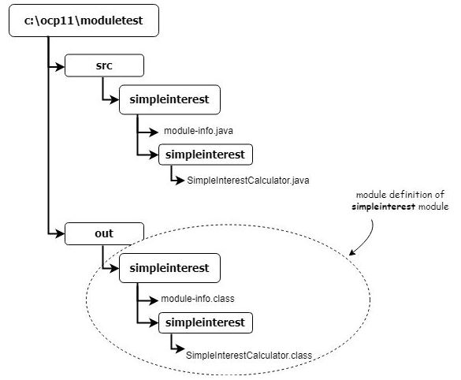

1. The module can be run using the below: 
    ```java
    java --module-path out --module simpleinterest/simpleinterest.SimpleInterestCalculator
    ```

1. Note that the format of the --module switch argument is \<module name>/\<main class name>.

1. The module is compiled into a JAR using the below:
    ```java
    jar --create --file simpleinterest.jar --main-class simpleinterest.SimpleInterestCalculator -C out\simpleinterest
    ```

1. The above command used 4 switches. The --create switch tells the JAR tool to create, the --file switch specifies the name of the file, the --main-class switch adds a Main-Class entry in the JAR file manifest, and the -C switch makes the JAR tool change working directories so that the structure inside the JAR file is the same as the structure inside out\simpleinterest. 

1. The module can now be run using the below:
    ```java
    java --module-path . --module simpleinterest
    ```

1. It is a good design practise to define functionality in the form of an interface and let the actual implementation implement that interface. Seperating the interface and the implementation into separate modules allows us to build an application by mixing and matching modules without the need to bundle classes that are not required for the application. An interface is added as shown below:
    ```java
    package calculators;
	public interface InterestCalculator{
		public double calculate(double principle, double rate, double time);
	}
    ```

1. The exports clause allows the public types within a package be eligible to be accessible by other modules. A module can only export packages, and not individual types. The contents of module-info.java for the calculators module is shown below:
    ```java
    module calculators{
		exports calculators;
	}
    ```

1. The requires clause is the counterpart of the exports clause. The purpose of having a requires class is to make the dependencies of a module explicitly clear to the users. The contents of module-info.java for the simpleinterest module is shown below:
    ```java
    module simpleinterest{
		requires calculators;
	}
    ```

1. A simplified SimpleInterestCalculator.java is shown below:
    ```java
    package simpleinterest;
	import calculators.InterestCalculator;
	public class SimpleInterestCalculator implements InterestCalculator{
		public double calculate(double principle, double rate, double time){
			return principle*rate*time;
		}
		public static void main(String[] args){
			InterestCalculator ic = new SimpleInterestCalculator();
			System.out.println(ic.calculate(100, .05, 2));
		}
	}
    ```

1. The directory structure after compilation is shown below:
	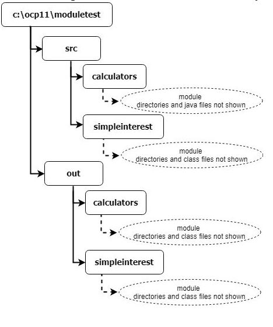

1. The exports clause allows any other module to require it. The Java module systems allows you to fine tune access to a module only to specific modules using a variation of the exports clause. This is shown below:
    ```java
    module <modulename>{
		exports <packagename> to <modulename(s)>;
	}
    ```

1. If a module A reads another module B, and module B reads another module C, module A does not read module C. That is to say that dependencies are not transitive. An example is shown below:
    ```java
    module ui{
		requires hr;
	}

    module hr{
		requires valueobjects;
		exports hrservice;
	}

	// code appearing in a class in the ui module
	HRService hrService = new HRService(); // HRService is defined in hr module
	Employee e = hrService.getEmployee(employeeId); // Employee is defined in valueObjects module
    ```

1. In this case the ui module does not have a requires valueobjects, so the ui module cannot access the Employee class from the valueobjects module. This code will fail to compile. A requires valueobjects could be added to the ui module, but there could be many requires clauses in the hr module. Only multiple compilation failures can make this information known to the ui module.

1. A **requires transitive** clause allows you to specify that if a module depends on another module, any module that depends on it should also depend on the other module. An example is shown below
    ```java
    module hr{
		requires transitive valueobjects;
		exports hrservice;
	}
    ```

1. This has the added advantage of not requiring a requires valueobjects clause in the ui module. The requires hr clause in the ui module automatically makes all of the modules transitively required by the hr module, readable to the ui module. This is called **implied readability**.

1. A modular JAR file can be ran using the -classpath or -jar options, however the JVM will not enforce the access rules specified in the module descriptor.

1. A common use case is wanting to develop a module that depends on a third party non-modular JAR. If you put a non-modular JAR on the module-path, Java will consider the non-modular JAR to be a module. Such a module is known as an **automatic module** or a **named module** and the name of the module is created automatically using the name of the JAR file.

1. As there is no module-info.class in a non-modular JAR, an automatic module exports all its packages and is allowed to read all exported packages of modules on the module-path and classes vailable on the classpath.

1. If a module depends on a non-modular third party JAR, you need to add a requires clause in module-info and put the third party JAR in the --module-path. If additionally the automatic module requires a class from another non-modular JAR, that JAR needs to be included on the classpath.

1. The specification of Standard modules are governed by the Java Community Process (JCP). Standard modules have names starting with "java". All other modules are part of the JDK and have names starting with "jdk". A standard module may contain both standard and non-standard API packages, however if the standard module exports a non-standard package then the export must be qualified. A standard module must not grant implied readability to any non-standard module. A non-standard module must not export any standard API packages.

### Understanding Java Technology and Environment

1. Java code is compiled into **Java bytecode**, which is interpreted by the JVM. A class file produced on one platform will run on any platform that has a JVM.

1. Java is a seperate application installed on top of an Operating System.

1. The **Java Runtime Environment (JRE)** includes the class libraries and executables that are required to run a Java program while the **Java Development Kit (JDK)** includes tools such as the Java compiler and the Java debugger. 

## Java SE 11 Programmer II

- [Java Fundamentals](#Java-Fundamentals)
- [Annotations](#Annotations)
- [Generics and Collections](#Generics-and-Collections)
- [Functional Programming](#Functional-Programming)
- [Exceptions, Assertions, and Localization](#Exceptions-Assertions-and-Localization)
- [Modular Applications](#Modular-Applications) 
- [Concurrency](#Concurrency) 
- [I/O](#I/O) 
- [NIO.2](#NIO.2) 
- [JDBC](#JDBC) 
- [Security](#Security)

### Java Fundamentals

1. A final variable does not need to be assigned when it is declared, only before it is used. A variable reference being marked as final does not mean the associated object cannot be modified. If an instance variable is final, then it must be assigned a value when it is declared or when the object is instantiated. Similiarly, static variables must be assigned a value when declared or in a static initialiser.

1. Methods marked final cannot be overriden by a subclass. This essentially prevents any polymorphic behaviour on the method call and ensures that a specific version of the method is always called. The opposite of a final method is an abstract method as an abstract method must be implemented.

1. A final class cannot be extended. A class cannot be both abstract and final.

1. An enum can be used to specify a fixed set of constants. Using an enum is better than using constants because it provides type-safe checking. Another advantage of an enum is the enum value can be used in a switch statement. An enum can contain methods but the first line must be the list of values. Note that if an enum has a body (e.g. default value) then the semicolon becomes mandatory.
    ```java
    public enum Season{
		WINTER, SPRING, SUMMER, FALL
	}
    ```

1. A nested class is one that is defined within another class. There are 4 types:
    * **Inner class:** A non-static type defined at the member level.
    * **Static nested class:** A static typed defined at the member level.
    * **Local class:** A class defined within a method body.
    * **Anonymous class:** A special case of a local class that does not have a name.

1. An inner class cannot declare static fields or methods, except for static final fields. It can also access members of the outer class including private methods. An inner classes will result in a Outer$Inner.class file being created by the compiler. As inner classes can have the same variable names as outer classes, a call to **this** is prefixed with the class name.

1. A static nested class can be instantiated without an instance of the enclosing class. However, it can't access the instance variables or methods in the outer class directly. It requires an explicit reference to the outer class variable. The nesting creates a namespace because the enclosing class name must be used to refer to it.

1. A local class is declared in a method, constructor or initialiser. A local class does not have any access modifiers and cannot be declared static, or declare static fields unless they are static final. When defined in an instance method, they have access to all fields and methods of the enclosing class. They can access local variables only if the variables are final or effectively final. An effectively final variable is one whose value does not change after it is set.

1. An anonymous class is a special form of a local class that does not have a name. It is declared and instantiated in one statement using the new keyword, a type name with parentheses, and a set of braces. Anonymous classes are required to extend an existing class or implement an existing interface.

1. The rules for modifiers in nested classes are summarised below:
	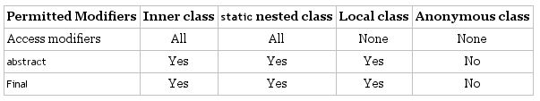

1. The rules for members in nested classes are summarised below:
	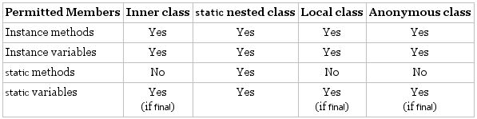

1. The rules for access in nested classes are summarised below:
	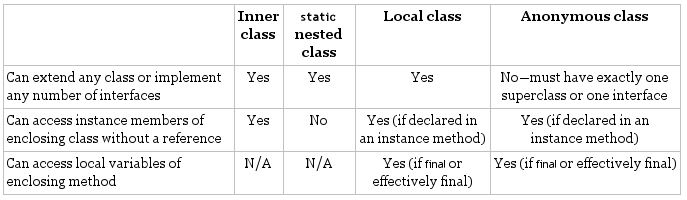

1. When Java was first released, there were only two types of members an interface declaration could include: abstract methods and static final variables. Since Java 8 and 9, new method types have been added. The interface member types are summarised below:
	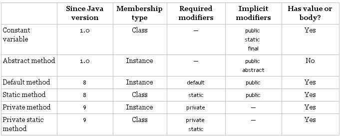

1. A default method may be declared within an interface to provide a default implementation. The default method is assumed to be public and cannot be marked abstract, final or static. It may also be overridden by a class that implements the interface. If a class inherits two or more default methods with the same method signature, then the class must override the method.

1. To call a default method from a class which overrides the implementation:
    ```java
    interfaceName.super.methodName();
    ```

1. A static interface method must include a method body and is assumed to be public. It cannot be marked abstract or final and cannot be referenced without using the interface name. Static interface methods are not inherited by a class implementing the interface.

1. A private interface method is used to avoid code duplication in instance methods. It must be marked private and include a method body. It may only be called by default and private (non-static) methods within the interface definition.

1. A private static method is used to avoid code duplication in static methods. It must be marked private and static and may only be called by other methods within the interface definition.

1. The rules for interface member access are summarised below:
    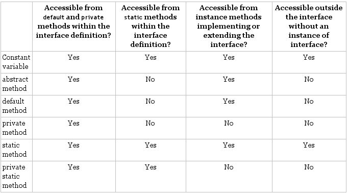

1. A functional interface is an interface that contains a single abstract method. A lambda expression is like an anonymous class that defines one method. Any functional interface can be implemented as a lambda expression.

1. Note that if a functional method includes an abstract method with the same signature as a public method found in Object, then those methods do not count towards the single abstract method test. This includes:
    ```java
    String toString()
    boolean equals(Object)
    int hashCode()
    ```

1. A lambda expression contains a parameter name, arrow and body. The parameters list the variables, which must be compatible with the type and number of input parameters of the functional interface's single abstract method. The body must also be compatible with the return type of the functional interface's abstract method. Example lamba expressions are shown below:
    ```java
    a -> a.canHop()
    (Animal a) -> {return a.canHop();}
    ```

1. A var parameter can be used in the parameter list, but then all parameters must use var. If the type is specified for one parameter then it must be specified for all parameters. A semicolon is mandatory in the body if there is only a single expression. An expression-based lambda body isn't terminated with a semicolon as it is an expression not a statement. However, a statement-based lambda with multiple lines requires that each statement be terminated with a semicolon. 

### Annotations

1. Annotations are all about metadata. They let you assign metadata attributes to classes, methods, variables and other Java types. An example is shown below:
    ```java
    public class Mammal{}
    public class Bird{}
    
    @ZooAnimal public class Lion extends Mammal{}
    @ZooAnimal public class Peacock extends Bird{}
    ```

1. The above could have been achieved by extending a ZooAnimal class but that would require the class hierarchy to be changed. Annotations are similar to interfaces. While interface can be applied to classes, annotations can be applied to classes, methods, expressions, and even other annotations. Annotations also allow a set of values to be passed. An example is shown below:
    ```java
    public class Veterinarian{
        @ZooAnimal(habitat="Infirmary") private Lion sickLion;
        @ZooAnimal(habitat="Safari") private Lion healthyLion;
        @ZooAnimal(habitat="Special Enclosure") private Lion blindLion;
    }
    ```

1. The values are part of the type declaration and not of the variable. Without annotations, a new Lion type for each habitat value would need to be defined. This would become difficult in large applications.

1. To declare an an annotation the @interface annotation is used. An example is shown below:
    ```java
    public @interface Exercise{}
    }
    ```

1. To apply the annotation to other code we simply use the @Exercise annotation. A parenthesis is required if there are elements specified, and optional otherwise. Examples are shown below:
    ```java
    @Exercise() public class Cheetah{}
    @Exercise public class Sloth{}
    @Exercise
    public class ZooEmployee{}
    ```

1. To declare an annotation with elements the elements need to be available in the annotation declaration. An example is shown below:
    ```java
    public @interface Exercise{}
        int hoursPerDay();
    }
    ```

1. This changes how the annotation is used. An example is shown below:
    ```java
    @Exercise(hoursPerDay=3) public class Cheetah{}
    ```

1. When declaring an annotation, any element without a default value is considered required. A default value must be a non-null constant expression. An example including a default value is shown below:
    ```java
    public @interface Exercise{}
        int hoursPerDay();
        int startHour() default 6;
    }
    ```

1. The element type must be a primitive type, a String, a Class, an enum, another annotation, or an array of any of these types. Note that this excludes wrapper classes and arrays of arrays.

1. Like abstract interface methods, annotation elements are implicitly abstract and public. Declaring elements protected, private or final will result in a compilation failure.

1. Like interface variables, annotation variables are implicitly public, static and final. A constant variable can be declared in an annotation but are not considered elements.

1. A shorthand format exists for using annotations. This can occur if the annotation declaration contains an element named *value()*, the usage of the annotation provides no values for other elements, and the declaration does not contain any elements that are required. An example is shown below:
    ```java
    public @interface Injured{
        String veterinarian() default "unassigned";
        String value() default "foot";
        int age() default 1;
    }

    @Injured("Legs") public void fallDown() {}
    ```

1. A shorthand format also exists for providing an array that contains a single element. An example is shown below:
    ```java
    public @interface Music{
        String[] genres();
    }

    public class Giraffe{
        @Music(genres={"Rock and roll"}) String mostDisliked;
        @Music(genres="Classical") String favorite;
    }
    ```

1. An annotation can be applied to an annotation to specify what types the annotation can be applied to. This is done by specifying the ElementType using @Target. An example is shown below:
    ```java
    @Target({ElementType.METHOD,ElementType.CONSTRUCTOR})
    public @interface ZooAttraction{}
    ```

1. The options for ElementType are shown below: 
	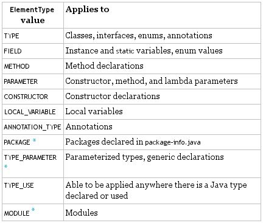

1. The TYPE_USE value covers nearly all other values. One exception is that it can only be used on a method that returns a value, a void method would still need METHOD defined in the annotation. TYPE_USE is typically used for cast operations, object creation with new and inside type declarations.

1. The compiler discards certain types of information when converting source code into a .class file. Annotations may be discarded by the compiler at runtime. The @Retention annotation can be used to specify. The options for @Retention are shown below:
    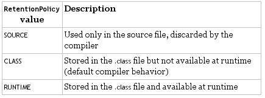

1. Javadoc is a built-in standard within Java that generates documentation for a class or API. If the @Documented annotation is present then the generated Javadoc will include annotation information defined on Java types. An example is shown below: 
    ```java
    // Hunter.java
    import java.lang.annotation.Documented;
    @Documented public @interface Hunter{}

    // Lion.java
    @Hunter public class Lion{}
    ```

1. In the above example @Hunter would be published with the Lion Javadoc information because it's marked with @Documented.

1. The @Inherited annotation is used to allow subclasses to inherit the annotation information found in the parent class.
    ```java
    // Vertebrate.java
    import java.lang.annotation.Inherited;
    @Inherited public @interface Vertebrate{}

    // Mammal.java
    @Vertebrate public class Mammal{}

    // Dolphin.java
    public class Dolphin extends Mammal{}
    ```

1. In the above example the @Vertebrate annotation will be applied to both Mammal and Dolphin.

1. The @Repeatable annotation can be used to apply an annotation more than once. To declare a @Repeatable annotation, a containing annotation with type value must be defined.
    ```java
    // Containing annotation type
    public @interface Risks{
        Risk[] value();
    }

    // Containing annotation class
    @Repeatable(Risks.class)
    public @interface Risk{
        String danger();
        int level() default 1;
    }

    public class Zoo{
        public static class Monkey{}
        @Risk(danger="Silly")
        @Risk(danger="Aggressive",level=5)
        @Risk(danger="Violent",level=10)
        private Monkey monkey;
    }
    ```

1. Commonly used built-in annotations are shown below:
    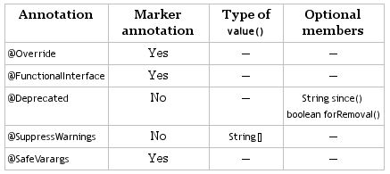

1. Example applications of commonly used annotations are shown below:
    

### Generics and Collections

1. Method references can make code more easy to read. An example is shown below:
    ```java
    @FunctionalInterface
    public interface LearnToSpeak{
        void speak(String sound);
    }

    public class DuckHelper{
        public static void teacher(String name, LearnToSpeak trainer){
            trainer.speak(name);
        }
    }

    // long version
    public class Duckling{
        public static void makeSound(String sound){
            LearnToSpeak learner = s -> System.out.println(s);
            DuckHelper.teacher(sound, learner);
        }
    }

    // short version
    public class Ducking{
        public static void makeSound(String sound){
            LearnToSpeak learner = System.out::println;
            DuckHelper.teacher(sound, learner);
        }
    }
    ```

1. There are four formats for method references. Examples are shown below:
    ```java
    // Static Methods
    Consumer<List<Integer>> methodRef = Collections::sort;
    Consumer<List<Integer>> lambda = x -> Collections.sort(x);

    // Instance Methods on a Particular Object
    var str = "abc";
    Predicate<String> methodRef = str::startsWith;
    Predicate<String> lambda = s -> str.startsWith(s);

    var random = new Random();
    Supplier<Integer> methodRef = random::nextInt;
    Supplier<Integer> lambda = () -> random.nextInt();

    // Instance Methods on a Parameter
    Predicate<String> methodRef = String::isEmpty;
    Predicate<String> lambda = s -> s.isEmpty();

    // Constructors
    Supplier<List<String>> methodRef = ArrayList::new;
    Supplier<List<String>> lambda = () -> new ArrayList();
    ```

1. Each Java primitive has a corresponding wrapper class. A null value can be assigned to a wrapper class as a null value can be assiged to any reference variable. Attempting to unbox a wrapper class with a null value will cause a NullPointerException.

1. The Diamond Operator is a shorthand notation that allows you to omit the generic type from the right side of a statement when the type can be inferred. An example is shown below:
    ```java
    List<Integer> list = new ArrayList<Integer>();
	List<Integer> list = new ArrayList<>();
    ```

1. A collection is a group of objects contained in a single object. The Java Collection Framework is a set of classes in java.util for storing collections. The common
	* **List:** Ordered collection of elements that can contain duplicates. Accessed by an int index.
	* **Set:** A collection that does not allow duplicate entries.
	* **Queue:** A collection that orders its elements in a specific order. A typical queue is FIFO.
	* **Map:** A collection that maps keys to values, with no duplicate keys allowed. The elements are key/value pairs.

1. The Collection interface and its subinterfaces as well as some implementing classes are shown below. Interfaces are shown in rectangles, with classes in rounded boxes:
    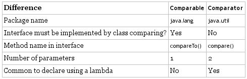

1. The Collection interface contains useful convenience methods. These are shown below:
    ```java
    boolean add(E element);
	boolean remove(Object object);
	boolean isEmpty();
	int size();
	void clear();
	boolean contains(Object object);
	boolean removeIf(Predicate<? super E> filter);
	void forEach(Consumer<? super T> action);
	```

1. The *Collections.sort()* method is commonly used when working with collections. To sort objects that you create yourself, Java provides an interface called Comparable. This is shown below:
    ```java
    public interface Comparable<T>{
        int compareTo(T o);
    }
	```

1. The *compareTo()* method returns:
    * The number 0 when the current object is equivalent to the argument to *compareTo()*.
    * A negative number when the current object is smaller than the argument to *compareTo()*.
    * A positive number when the current object is larger than the argument to *compareTo()*.

1. An example is shown below:
    ```java
    public class MissingDuck implements Comparable<MissingDuck>{
        private String name;
        public int compareTo(MissingDuck quack){
            if(quack == null)
                throw new IllegalArgumentException("Poorly formed duck!");
            if(this.name == null && quack.name == null)
                return 0;
            else if(this.name == null) return -1;
            else if(quack.name == null) return 1;
            else return name.compareTo(quack.name);
        }
    }
	```

1. Note that only one *compareTo()* method can be implemented for a class. If we want to sort by something else, a Comparator can be used. Comparator is a functional interface. An example is shown below:
    ```java
    public static void main(String[] args){
        Comparator<Duck> byWeight = new Comparator<Duck>(){
            public int compare(Duck d1, Duck d2){
                return d1.getWeight()-d2.getWeight();
            }
        }
    };

    // alternate implementation with lambda
    Comparator<Duck> byWeight = (d1,d2) -> d1.getWeight()-d2.getWeight();
    
    // alternate implementation with method reference
    Comparator<Duck> byWeight = Comparator.comparing(Duck::getWeight);
    
    Collection.sort(ducks, byWeight);
	```

1. A summary of the differences between Comparable and Comparator are shown below:
    

1. When building a comparator there are several helper methods that can be used. These are shown below:
    ```java
    reversed();
    thenComparing(function);
    thenComparingDouble(function);
    thenComparingInt(function);
    thenComparing(function);
	```

1. Generics allow you to write and use parametrised types. This allows the compiler to detect issues rather than a ClassCastException exception being thrown.

1. Generics can be introduced into classes using angle brackets. An example is shown below:
    ```java
    public class Crate<T>{
        private T contents;
        public T emptyCrate(){
            return contents;
        }
        public void packCrate(T contents){
            this.contents = contents;
        }
    }
	```

1. A type parameter can have any name. By convention the below letters are used:
    * E for an element
    * K for a map key
    * V for a map value
    * N for a number
    * T for a generic data type
    * S, U, V etc. for multiple generic types

1. Generics can also be introduced into methods using angle brackets. An example is shown below:
    ```java
    public class Handler{
        public static <T> Crate<T> ship(T t){
            System.out.println("Shipping " + t);
            return new Crate<T>();
        }
    }
	```

1. A bounded parameter type is a generic type that specifies a bound for the generic. A wildcard generic type is an unknown generic type represented with a question mark.  

1. An unbounded wildcard is used when any type is okay. An example is shown below:
    ```java
    public static void printList(List<?> list){
        for (Object x:list)
            System.out.println(x);
    }
    ```

1. Note that a generic type can't use a subclass. An example that will not compile is shown below:
    ```java
    ArrayList<Number> list = new ArrayList<Integer>();
    ```

1. An upper-bounded wildcard can be used to say that any class that extends a class or that class itself can be the parameter type. An example is shown below:
    ```java
    public static long total(List<? extends Number> list){
        long count = 0;
        for(Number number:list)
            count += number.longValue();
        return count;
    }
    ```

1. Note that due to type erasure the above code is converted to something like:
    ```java
    public static long total(List list){
        long count = 0;
        for(Object obj:list)
            Number number = (Number) obj;
            count += number.longValue();
        }
        return count;
    }
    ```

1. When upper bounds or unbounded wildcards are used in such a way the list becomes immutable and cannot be modified.

1. A lower-bounded wildcard can be used to say that any instance of a class or an instance of a superclass can be the parameter type. An example is shown below:
    ```java
    public static void addSound(List<? super String> list){
        list.add("quack");
    }

    List<String> strings = new ArrayList<String>();
    strings.add("tweet");
    
    List<Object> objects = new ArrayList<Object>(strings);
    addSound(strings);
    addSound(objects);
    ```

1. A useful mnemonic is PECS: Producer Extends, Consumer Super. If you need a List to produce T values (you want to read Ts from the list), you need to declare it using extends. If you need a list to consume T values (you want to write Ts into the list), you need to declare it using super. If you need to both read and write to a list you need to declare it exactly with no wildcards.

1. In the below example, if you want to write elements into the list, you can't add a Number, Integer or a Double because each one is not compatible with all types. A Number can be read because any of the lists will contain a Number or a subclass of Number. When using extends like this you can only read, and not write.
    ```java
    List<? extends Number> foo = new ArrayList<>();

    // The foo list could be one of these
    List<? super IOException> foo = new ArrayList<Number>();
    List<? super IOException> foo = new ArrayList<Integer>();
    List<? super IOException> foo = new ArrayList<Double();
    ```

1. In the below example, if you want to write elements into the list, you can add an IOException or a FileNotFoundException but not an Exception.  This is because an Exception can't be added to a a list of a more specific subclass. An Object can be read from this list but you won't know which type.
    ```java
    List<? super IOException> foo = new ArrayList<>();

    // The foo list could be one of these
    List<? super IOException> foo = new ArrayList<Exception>();
    List<? super IOException> foo = new ArrayList<IOException>();
    List<? super IOException> foo = new ArrayList<Object>();
    ```

### Functional Programming

1. The functional interfaces shown below are provided as built-in functional interfaces in the java.util.function package.
    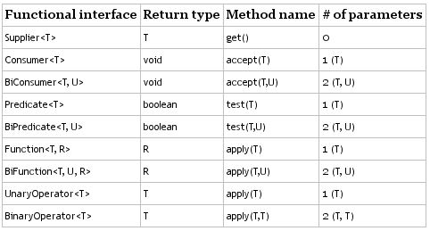

1. A Supplier is used when you want to generate or supply values without taking any input. A supplier is often used to construct new objects. The definition is shown below:
	```java
    @FunctionalInterface
	public interface Supplier<T>{
		T get();
	}
    ```

1. An example for Supplier is shown below:
	```java
    Supplier<LocalDate> s1 = LocalDate::now;
	Supplier<LocalDate> s2 = () -> LocalDate.now();

	LocalDate d1 = s1.get();
	LocalDate d2 = s2.get();
    ```

1. A Consumer is used when you want to do something with a parameter but not return anything. A BiConsumer is the same but takes two parameters. The definitions are shown below:
	```java
    @FunctionalInterface
	public interface Consumer<T>{
		void accept(T t);
		// default method omitted
	}

    @FunctionalInterface
	public interface BiConsumer<T, U>{
		void accept(T t, U u);
		// default method omitted
	}
    ```

1. An example for Consumer is shown below:
	```java
	Consumer<String> c1 = System.out::println;
	Consumer<String> c2 = x-> System.out.println(x);
	
	c1.accept("Hi");
	c2.accept("Hi");
	```

1. An example for BiConsumer is shown below:
	```java
    var map = new HashMap<String, Integer>();
	BiConsumer<String, Integer> b1 = map::put;
	BiConsumer<String, Integer> b2 = (k, v) -> map.put(k, v);

	b1.accept("chicken", 7);
	b2.accept("chick", 1);
    ```

1. A Predicate is often used when filtering or matching. A BiPredicate is the same but takes two parameters. The definitions are shown below:
	```java
    @FunctionalInterface
	public interface Predicate<T>{
		boolean test(T t);
		// default and static methods omitted
	}

    @FunctionalInterface
	public interface BiPredicate<T, U>{
		boolean test(T t, U t);
		// default methods omitted
	}
    ```

1. An example for Predicate is shown below:
	```java
	Predicate<String> p1 = String::isEmpty;
	Predicate<String> p2 = x -> x.isEmpty();
	System.out.println(p1,test(""); // true
	System.out.println(p2,test(""); // true
	```

1. An example for BiPredicate is shown below:
	```java
	BiPredicate<String, String> b1 = String::startsWith;
	BiPredicate<String, String> b2 = (string, suffix) -> string.startsWith(prefix);

	System.out.println(b1.test("chicken", "chick")); // true
	System.out.println(b2.test("chicken", "chick")); // true
	```

1. A Function turns one parameter into a value of a potentially different type and returns it. A BiFunction turns two parameters into a value and returns it. The definitions are shown below:
	```java
    @FunctionalInterface
	public interface Function<T, R>{
		R apply(T t);
		// default and static methods omitted
	}

    @FunctionalInterface
	public interface BiFunction<T, U, R>{
		R apply(T t, U u);
		// default method omitted
	}
    ```

1. An example for Function is shown below:
	```java
	Function<String, Integer> f1 = String::length;
	Function<String, Integer> f2 = x -> x.length();
	
	System.out.println(f1.apply("cat")); // 3
	System.out.println(f2.apply("cat")); // 3
	```

1. An example for BiFunction is shown below:
	```java
	BiFunction<String, <String, String> b1 = String::concat;
	BiFunction<String, <String, String> b2 = (string, toAdd) -> string.concat(toAdd);

	System.out.println(b1.apply("cat ", "dog")); // cat dog
	System.out.println(b2.apply("cat ", "dog")); // cat dog
	```

1. A UnaryOperator is a special case of a Function where all the type parameters are the same type. A BinaryOperator merges two values into one of the same type. The definitions are shown below:
	```java
	@FunctionalInterface
	public interface UnaryOperator<T> extends Function<T, T>{}

	@FunctionalInterface
	public interface BinaryOperator<T> extends BiFunction<T,T,T>{
	// omitted static methods
	}
	```

1. An example for UnaryOperator is shown below:
	```java
	UnaryOperator<String> u1 = String::toUpperCase;
	UnaryOperator<String> u2 = x -> x.toUpperCase();

	System.out.println(u1.apply("hi")); // HI
	System.out.println(u2.apply("hi")); // HI
	```

1. An example for BinaryOperator is shown below:
	```java
	BinaryOperator<String> b1 = String::concat;
	BinaryOperator<String> b2 = (string, toAdd) -> string.concat(toAdd);

	System.out.println(u1.apply("hi ", "there")); // hi there
	System.out.println(u2.apply("hi ", "there")); // hi there
	```

1. The built-in functional interfaces contain various helpful default methods. An example for the Predicate helper methods is shown below with the two statements being equivalent:
	```java
	Predicate<String> combination = s -> s.contains("cat") && ! s.contains("brown");
	Predicate<String> combination = cat.and(brown.negate());
	```

1. An example for the Consumer helper methods is shown below:
	```java
	Consumer<String> c1 = x -> System.out.print("1:" + x);
	Consumer<String> c2 = x -> System.out.print(",2:" + x);

	Consumer<String> combined = c1.andThen(c2);
	combined.accept("hi"); // 1:hi,2:hi
	```

1. An example for the Function helper methods is shown below:
	```java
	Function<Integer, Integer> before = x -> x + 1;
	Function<Integer, Integer> after = x -> x * 2;
	
	Function<Integer, Integer> combined = after.compose(before);
	System.out.println(combined.apply(3)); // 8
	```

1. An Optional type is used to express a result that could be "not applicable" without using null references. The Optional instance methods are summarised below:
	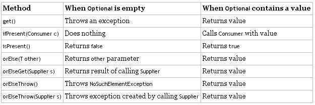

5. An example using the *isPresent()* and *get()* methods is shown below:
	```java
	public static Optional<Double> average(int... scores){
        if(scores.length == 0) return Optional.empty();
        int sum = 0;
        for(int score:scores) sum += score;
        return Optional.of((double) sum/scores.length);
    }

    Optional<Double> opt = average(90, 100);
    if(opt.isPresent())
        System.out.println(opt.get()); // 95.0
	```

1. The *ofNullable()* method can be used to return an empty Optional if the value is null:
	```java
	Optional o (value == null) ? Optional.empty() : Optional.of(value);
    Optional o = Optional.ofNullable(value);
	```

1. The *ifPresent()* method can be used to specify a Consumer to be run when there is a value inside of an Optional:
	```java
	Optional<Double> opt = average(90, 100);
    opt.ifPresent(System.out::println);
	```

1. There are multiple methods that can be used to handle an empty Optional. Note that if the value does exist then the value will just be printed. Examples are shown below:
	```java
	Optional<Double> opt = average();
    System.out.println(opt.orElse(Double.NaN)); // NaN
    System.out.println(opt.orElseGet(() -> Math.random())); // random number
    System.out.println(opt.orElseThrow()); // NoSuchElementException
    System.out.println(opt.orElseThrow(
        () -> new IllegalStateException())); // Can throw something else
	```

1. A **stream** in Java is a sequence of data. A stream pipeline consists of the operations that run on a stream to produce a result. A stream can be finite or infinite.

1. A stream pipeline consists of:
	* **Source:** Where the stream comes from.
	* **Intermediate operations:** Transforms the stream into another one. There can be many intermediate operations. They do not run until the terminal operation runs.
	* **Terminal operations:** Produces a result. A stream can only be used once, the stream is no longer valid after a terminal operation completes.

1. The Stream<T> interface is defined in the java.util.stream package.

1. Examples for creating a finite stream are shown below:
	```java
	Stream<String> empty = Stream.empty(); // 0
	Stream<Integer> singleElement = Stream.of(1); // 1
	Stream<Integer> fromArray = Stream.of(1,2,3); // 3

	var list = List.of("a","b","c");
	Stream<String> fromList = list.stream();
	Stream<String> fromListParallel = list.parallelStream();
	```

1. Examples for creating an infinite stream are shown below:
	```java
	Stream<Double> randoms = Stream.generate(Math::random);
	Stream<Integer> oddNumbers = Stream.iterate(1, n -> n + 2);
	Stream<Integer> oddNumbersUnder100 = Stream.iterate{
		1, // seed
		n -> n < 100; // Predicate to specify when done
		n -> n + 2; // UnaryOperator to get next value
	}
	```

1. A terminal operation can be performed without an interediate operations. Reductions are a special type of terminal operation where the contents of the stream are combined into a single primitive or Object. Terminal stream operation method signatures and examples are shown below:
	```java
	// long count()
	Stream<String> s = Stream.of("monkey", "gorilla", "bonobo");
	System.out.println(s.count()); // 3

	// Optional<T> min(Comparator<? super T> comparator)
	// Optional<T> max(Comparator<? super T> comparator)
	Stream<String> s = Stream.of("monkey", "ape", "bonobo");
	Optional<String> min = s.min((s1, s2) -> s1.length()-s2.length());
	min.ifPresent(System.out.println); // ape

	Optional<?> minEmpty = Stream.empty().min((s1, s2) -> 0);
	System.out.println(minEmpty.isPresent()); // false
	
	// Optional<T> finndAny()
	// Optional<T> findFirst()
	Stream<String> s = Stream.of("monkey", "gorilla", "bonobo");
	Stream<String> infinite = Stream.generate(() -> "chimp");
	s.findAny().ifPresent(System.out:prinln); // monkey (usually)
	infinite.findAny().ifPresent(System.out::println); // chimp

	// boolean anyMatch(Predicate<? super T> predicate)
	// boolean allMatch(Predicate<? super T> predicate)
	// boolean noneMatch(Predicate<? super T> predicate)

	var list = List.of("monkey", "2", "chimp");
	Stream<String> infinite = Stream.generate(() -> "chimp");
	Predicate<String> pred = x -> Character.isLetter(x.charAt(0));

	System.out.println(list.stream().anyMatch(pred)); // true
	System.out.println(list.stream().allMatch(pred)); // false
	System.out.println(list.stream().noneMatch(pred)); // false
	System.out.println(infinite.anyMatch(pred)); // true

	// void forEach(Consumer<? super T> action)

	Stream<String> s = Stream.of("Monkey", "Gorilla", "Bonobo");
	s.forEach(System.out::print); // MonkeyGorillaBonobo

	// T reduce(T identity, BinaryOperator<T> accumulator)
	// Optional<T> reduce(BinaryOperator<T> accumulator)
	// <U> reduce(U identity,
	// BiFunction<U, ? super T, U> accumulator,
	// BinaryOperator<U> combiner)

	Stream<String> stream = Stream.of{"w", "o", "l", "f"};
	String word = stream.reduce("", (s,c) -> s + c);
	System.out.println(word); // wolf;

	// <R> R collect(Supplier<R> supplier,
	// BiConsumer(<R, ? super T> accumulator,
	// BiConsumer<R, R> combiner)
	// <R, A> R collect(Collector<? super T, A, R> collector)

	Stream<String> stream = Stream.of("w", "o", "l", "f");
	TreeSet<String> set = stream.collect(
		Treeset::new,
		Treeset::add,
		Treeset::addAll);
	System.out.println(set); // [f, l, o, w]
	```

1. An intermediate operation produces a stream as its result. Intermediate operation method signatures and examples are shown below:
	```java
	// Stream<T> filter(Predicate<? super T> predicate)

	Stream<String> s = Stream.of("monkey", "gorilla", "bonobo");
	s.filter(x -> x.startsWith("m"))
		.forEach(System.out::print); // monkey

	// Stream<T> distinct()

	Stream<String> s = Stream.of("duck", "duck", "duck", "goose");
	s.distinct()
		.forEach(System.out::print); // duckgoose

	// Stream<T> limit(long maxSize)
	// Stream<T> skip(long n)

	Stream<Integer> s = Stream.iterate(1, n -> n + 1);
	s.skip(5)
		.limit(2)
		.forEach(System.out::print); // 67

	// <R> Stream<R> map(Function<? super T>, ? extends R> mapper)
	Stream<String> s = Stream.of("monkey", "gorilla", "bonobo");
	s.map(String::length)
		.forEach(System.out::print); // 676

	// <R> Stream<R> flatMap(
		Function<? super T, ? extends Stream<? extends R>> mapper)

	List<String> zero = List.of();
	var one = List.of("Bonobo");
	var two = List.of("Mama Gorilla", "Baby Gorilla");
	Stream<List<String>> animals = Stream.of(zero, one, two);

	animals.flatMap(m -> m.stream())
		.forEach(System.out::println);

	// Bonobo
	// Mama Gorilla
	// Baby Gorilla

	// Stream<T> sorted()
	// Stream<T> sorted(Comparator<? super T> comparator>

	Stream<String> s = Stream.of("brown-", "bear-"):
	s.sorted()
		.forEach(System.out:print); // bear-brown-

	Stream<String> s = Stream.of("brown bear-", "grizzly-");
	s.sorted(Comparator.reverseOrder())
		.forEach(System.out::print); // grizzly-brown bear-

	// Stream<T> peek(Consumer<? super T> action)
	
	var stream = Stream.of("black bear", "brown bear", "grizzly");
	long count = stream.filter(s -> s.startsWith("g"))
		.peek(System.out::println).count() // grizzly
	System.out.println(count); // 1
	```

1. Intermediate and a terminal operation can be chained in a pipeline. An example is shown below:
	```java
	var list = List.of("Toby", "Anna", "Leroy", "Alex");
	list.stream()
		.filter(n -> n.length() == 4)
		.sorted()
		.limit(2)
		.forEach(System.out::println); // AnnaAlex
	```

1. Primitive Streams allow you to work with the int, double and long primitives. They include specialised methods for workig with numeric data. The primitive streams are intStream, longStream and doubleStream.

1. Primitive streams can be created from other streams. An example is shown below:
	```java
	Stream<String> objStream = Stream.of("penguin", "fish");
	IntStream intStream = objStream.mapToInt(s -> s.length());
	```

1. To create a primitive stream from another stream the below methods are used:
	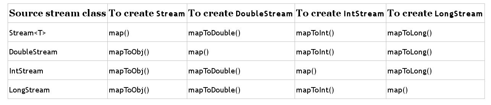

1. The function parameters used when mapping streams are shown below:
	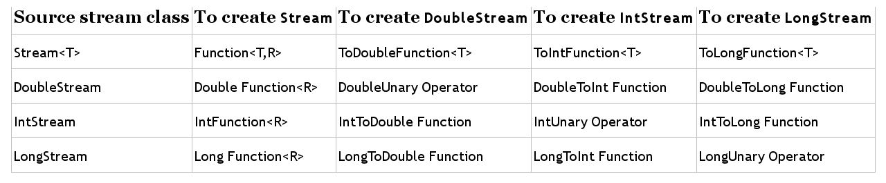

1. Methods can return OptionalDouble, OptionalInt and OptionalLong types when dealing with streams of primitives. A summary of the Optional types for primitives is shown below:
	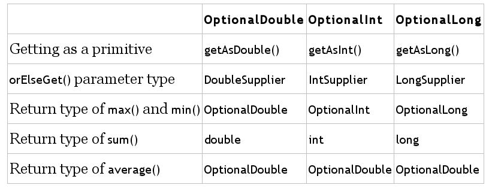

1. To use multiple terminal operations to produce a result from a stream summary statistics can be used. Summary statistics includes the *getMin()*, *getMax()*, *getAverage()*, *getSum()* and *getCount()* methods. An example is shown below:
	```java
	private static int range(intStream ints){
		IntSummaryStatistics stats = ints.summaryStatistics();
		if(stats.getCount() == 0) throw new RuntimeException();
		return stats.getMax()-stats.getMin();
	}
	```

1. There are special functional interfaces for primitives. The BooleanSupplier functioan interface is shown below:
	```java
	// boolean getAsBoolean()

	BooleanSupplier b1 = () -> true;
	BooleanSupplier b2 = () -> Math.random() > 0.5;
	System.out.println(b1.getAsBoolean()); // true
	System.out.println(b2.getAsBoolean()); // true or false
	```

1. Common functional interfaces for other primitives are shown below:
	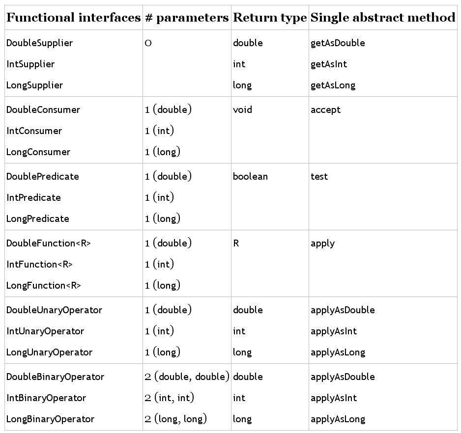

1. Common functional interfaces for other primitives are shown below:
	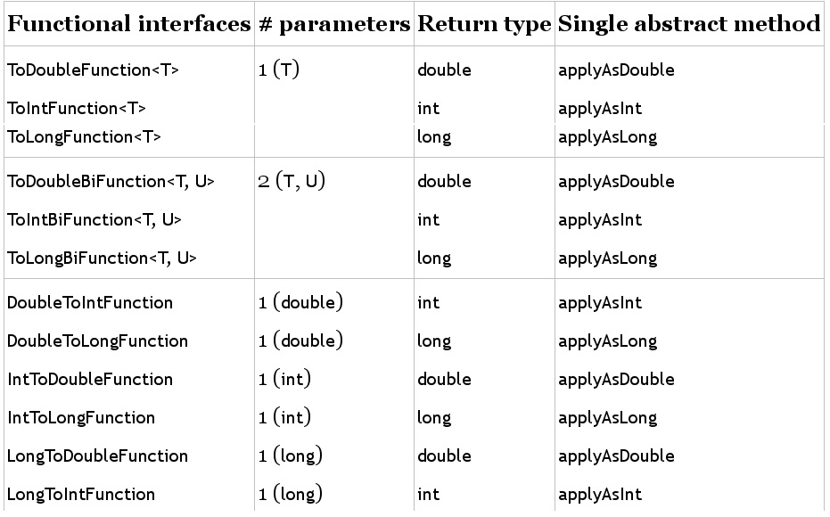

1. Predefined collectors are available via static methods on the Collectors interface. These are shown below:
	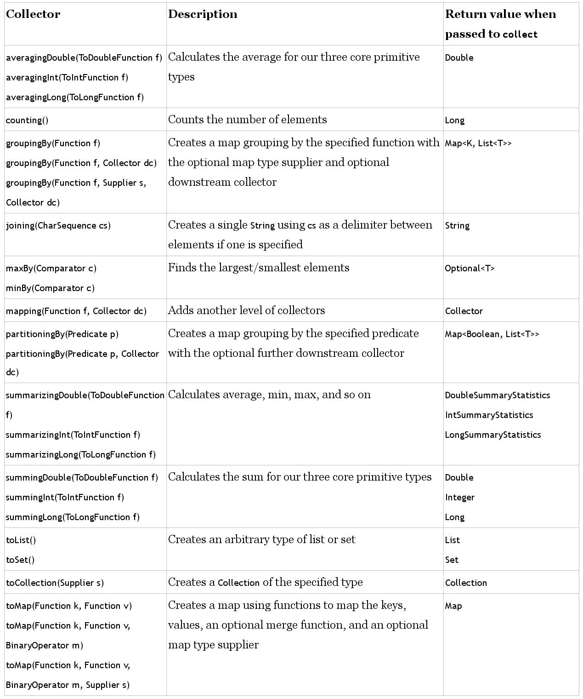

1. Examples for using collectors are shown below:
	```java
	var ohMy = Stream.of("lions", "tigers", "bears");
	String result = ohMy.collect(Collectors.joining(", "));
	System.out.println(result); // lions, tigers, bears

	var ohMy = Stream.of("lions", "tigers", "bears");
	String result = ohMy.collect(Collectors.averagingInt(String::length));
	System.out.println(result); // 5.333333333333

	var ohMy = Stream.of("lions", "tigers", "bears");
	TreeSet<String> result = ohMy
		.filter(s -> s.startsWith("t))
		.collect(Collectors.toCollection(TreeSet::new));
	System.out.println(result); // [tigers]

	var ohMy = Stream.of("lions", "tigers", "bears");
	Map<String, Integer> map = ohMy.collect(
		Collectors.toMap(s -> s, String::length));
	Systemout.println(map); // {lions=5, bears=5, tigers=6}

	var ohMy = Stream.of("lions", "tigers", "bears");
	Map<Integer, String> map = ohMy.collect(Collectors.toMap(
		String::length,
		k -> k,
		(s1, s2) -> s1 + "," + s2));
	System.out.println(map); // {5=lions,bears, 6=tigers}
	System.out.println(map.getClass()); // class java.util.HashMap

	var ohMy = Stream.of("lions", "tigers", "bears");
	Map<Integer, List<String>> map = ohMy.collect(
		Collectors.groupingBy(String::length));
	System.out.println(map); // {5=[lions, bears], 6=[tigers]}

	var ohMy = Stream.of("lions", "tigers", "bears");
	Map<Boolean, List<String> map = ohMy.collect(
		Collectors.partitioningBy(s -> s.length() <= 5));
	System.out.println(map); // {false=[tigers], true=[lions, bears]}
	```

### Exceptions, Assertions, and Localization

1. A custom exception class can be created by extending Exception (for a checked exception), or RuntimeException (for an unchecked exception).

1. A try-with-resources statement ensures that any resources declared in the try block are automatically closed at the conclusion of the try block. A resource is typically a file or a database that requires some kind of stream or connection to read or write data. 

1. To be used in a try-with-resources statement the resource is required to implement the AutoClosable interface. Inheriting AutoClosable requires implementing a *close()* method. If multiple resources are included in a try-with-resources statement they are closed in the reverse order in which they are declared.

1. It is possible to use resources declared prior to a try-with-resources statement, provided they are marked final or are effectively final. The syntax is to use the resource name in place of the resource declaration, seperated by a semicolon.

1. An assertion is a boolean expression that you place where you expect something to be true. An assert statement contains this statement along with an optional message. An assertion allows for detecting defects in the code. You can turn on assertions for testing and debugging while leaving them off when your program is in production. Unit tests are most frequently used to verify behaviour, whereas assertions are commonly used to verify the internal state of a program.

1. Assertions should never alter outcomes. Assertions should be turned off in a production environment.

1. The syntax for an assertion is shown below:
	```java
	assert test_value;
	assert test_value: message;
	```

1. An assertion evaluating to false will result in an AssertionError being thrown at runtime if assertions are enabled. To enable assertions a flag can be passed as per the below:
	```java
	java -enableassertions Rectangle
	java -ea Rectangle
	```

1. Assertions can be enabled or disabled for specific classes or packages.
	```java
	java -ea:com.demos... my.programs.Main // enable for classes in the com.demos package and any subpackages
	java -ea:com.demos... -da:com.demos.TestColors my.programs.Main // enable for com.demos but disables in TestColors class
	```

1. Java includes numerous classes for dates and times:
	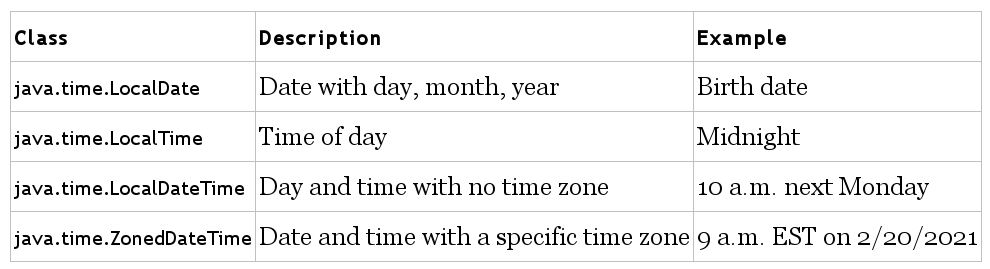

1. Each of these types contains a *now()* method to get the current date or time and an *of()* method to instantiate an object. Various get methods are also provided.

1. The *format()* method can take a DateTimeFormatter to display standard or custom formats. Note that enclosing values in single quotes escapes the values. Examples are shown below:
	```java
	LocalTime time = LocalTime.of(11, 12, 34);
	LocalDate date = LocalDate.of(2020, Month.OCTOBER, 20);
	System.out.println(time.format(DateTimeFormatter.ISO_LOCAL_TIME)); // standard format example
	var f = DateTimeFormatter.ofPattern("MMMM dd, yyyy 'at' hh:mm");
	System.out.println(dt.format(f)); // October 20, 2020 at 11:12
	```

1. Supported symbols for each date and time class are shown below:
	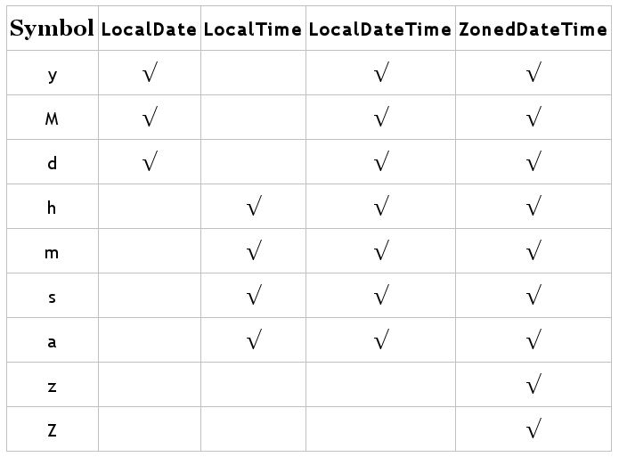

1. Internationalisation is the process of designing a program so that it can be adapted. Localisation means supporting multiple locales or geographic regions. Examples for working with locales are shown below:
	```java
	Locale locale = Locate.getDefault();
	System.out.println(locale); // en_US
	System.out.println(Locate.GERMAN); // de
	System.out.println(Locale.GERMANY); // de_DE
	```

1. Formatting or parsing currency and number values can change depending on the locale. Methods to get a number format based on a locale are shown below:
	

1. An example of their usage is shown below:
	```java
	int attendeesPerYear = 3_200_000;
	int attendeesPerMonth = attendeesPerYear / 12; 
	var us = NumberFormat.getInstance(Locale.US);
	System.out.println(us.format(attendeesPerMonth)); // 266,666
	var gr = NumberFormat.getInstance(Locale.GERMANY);
	System.out.println(gr.format(attendeesPerMonth)); /// 266.666
	```

1. The DecimalFormat class can be used to express currency. A *#* is used to omit the position if no digit exists, and a 0 is used to place a 0 in the position if no digit exists. Examples are shown below:
	```java
	double d = 1234567.467;
	NumberFormat f1 = new DecimalFormat("###,###,###.0");
	System.out.println(f1.format(d)); // 1,234,567.5
	```

1. Date formats can also vary by locale. Methods used to retrieve an instance of DateTimeFormatter using the default locale are shown below:
	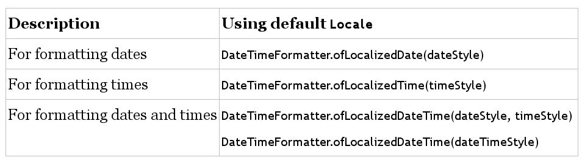

1. A resource bundle contains locale-specific objects used by a program. It is commonly stored in a properties file. A properties file is a text file in a specific format with key/value pairs.

1. An example using two property files is shown below:
	```java
	Zoo_en.properties // name of file
	hello=Hello
	open=The zoo is open

	Zoo_fr.properties // name of file
	hello=Bonjour
	open=Le zoo est ouvert

	public static void printWelcomeMessage(Locale locale){
		var rb = ResourceBundle.getBundle("Zoo", locale);
		System.out.println(rb.getString("hello") + "," + rb.getString("open"));
	}

	public static void main(String[] args){
		var us = new Locale("en", "US");
		var france = new Locale("fr", "FR");
		printWelcomeMessage(us);
		printWelcomeMessage(france);
	}
	```

1. To find a resource bundle to use Java looks for the language/country in the filename, followed by just the language. The default resource bundle is used if no matching locale can be found.

### Modular Applications

1. There are three types of modules:
	* **Named Modules:** Contains a module-info file which appears in the root of the JAR alongside one or more packages. Unless otherwise specified, a module is a named module. Named modules appear on the module path rather than the classpath.
	* **Automatic Module:** Appears on the module path but does not contain a module-info file. It is a regular JAR file that is placed on the module path and gets treated as a module. The code referencing an automatic module treats it as if there is a module-info present, and automatically exports all packages. If an Automatic-Module-Name is specified in the manifest then that name is used. Otherwise, a module name is automatically determined based on the JAR filename. To determine the name the file extension is removed, then the version number, and then special characters are replaced with a period. If a period is the first or last character it is also removed.
	* **Unnamed Module:** Like an automatic module, it is a regular JAR file. An unnamed module is on the classpath rather than the module path. An unnamed module does not usually contain a module-info file, and if it does, it is ignored since it is on the classpath. Unnamed modules do not export any packages to named or automatic modules, and an unnamed module can read from any JARs on the classpath or module path.

1. Modules prefixed with *java* (standard modules) are shown below:
	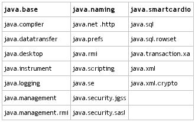

1. Modules prefixed with *jdk* (part of the JDK) are shown below:
	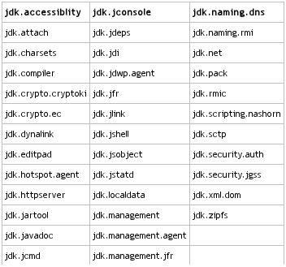

1. The *jdeps* command provides information about dependencies. An example is shown below:
	```java
	// Animatronic.java

	import java.time.*;
	import java.util.*;
	import sun.misc.Unsafe;

	public class Animatronic {
		private List<String> names;
		private LocalDate visitDate;

		public Animatronic(List<String> names, LocalDate visitDate){
			this.names = names;
			this.visitDate = visitDate;
		}
	
		public void unsafeMethod(){
			Unsafe unsafe = Unsafe.getUnsafe();
		}
	}
	```

	```shell
	javac *.java
	jar -cvf zoo.dino.jar .
	jdeps zoo.dino.jar
	```

1. Before older applications can be migrated to use modules, the structure of the packages and libraries in the existing application need to be determined. In the below diagram style the arrows point from the project that will require the dependency to the one that makes it available. Projects that do not have any dependencies are at the bottom.
	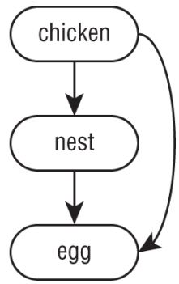

1. A bottom-up migration is the easiest migration approach. It works when you have the power to convert any JAR files that aren't already modules. The approach is:
    * Pick the lowest-level project that has not yet been migrated.
	* Add a module-info.java file to that project. Be sure to add any exports to expose any package used by higher level JAR files. Also, add the requires directive for any modules it depends on.
	* Move this newly migrated named module from the classpath to the module path.
	* Ensure any projects that have not yet been migrated stay as unnamed modules on the classpath.
	* Repeat with the next-lowest-level project until you are done.

1. A top-down migration is most useful when you don't have control of every JAR file used by your application. The approach is:
	* Place all projects on the module path.
	* Pick the highest-level project that has not yet been migrated.
	* Add a module-info file to that project to convert the automatic module into a named module. Remember to add any exports or requires directives. Automatic module names can be used when writing the requires directive since most of the projects on the module path do not have names yet.
	* Repeat with the next-highest-level project until you are done.

1. An example of the bottom-up migration approach (left) and top-down migration approach (right) is shown below:
	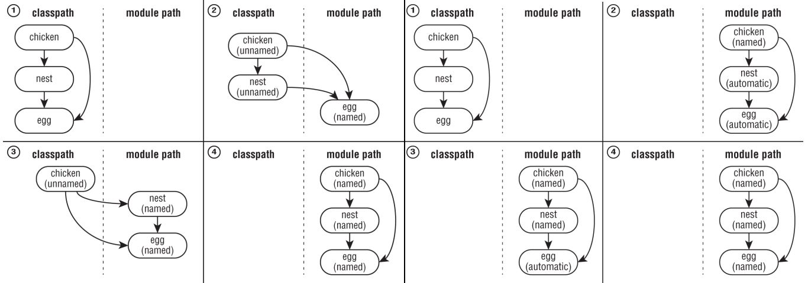

1. When splitting up a project into modules, a problem with **cyclic dependencies** may arise. A cyclic dependency occurs when 2 or more things have dependencies on each other. Modules that have cyclic dependenencies will not compile. A common technique to resolve this issue is to introduce another module containing all the code that the modules share. Note that a cyclic dependency can still exists between packages with a module.

1. Although not recommended, is possible to customise what packages a module exports from the command line.
	```java
	javac --add-reads moduleA=moduleB --add-exports moduleB/com.modB.package1=moduleA ...
	java --add-reads moduleA=moduleB --add-exports moduleB/com.modB.package1=moduleA ...
	// --add-reads moduleA=moduleB implies that moduleA wants to read all exported packages of moduleB
	// add-exports moduleB/com.modB.package1=moduleA implies that moduleB exports package com.modB.package1 to moduleA
	// add-open is used ot provide access to privat members of classes through reflection (not required for exam)
	```

1. The previous section discussed modules in terms of dependencies, with one module exporting its public types and another module requiring them.  This is a very tight coupling. A looser coupling can be if one module requires an implementation of an interface from another module, and the other module provides that implementation.

1. A **service** is composed of an interface, classes referenced by the interface references, and a way to look up the implementations of the interface. A sample tours application will be used to introduce this concept. The 4 modules within this application are shown below:
	

1. A **service provider interface** specifies the behaviour that the service will have. The service provider interface is exported for other modules to use. For the tours application this is shown below:
	```java
	// Souvenir.java
	package zoo.tours.api;

	public class Souvenir{
		private String description;

		public String getDescription(){
			return description;
		}

		public void setDescription(String description){
			this.description = description;
		}
	}

	// Tour.java
	package zoo.tours.api;
	
	public interface Tour {
		String name();
		int length();
		Souvenir getSouvenir();	
	}

	// module-info.java
	module zoo.tours.api{
		exports zoo.tours.api;
	}
	```

1. A **service locator** is able to find any classes that implement a service provider interface. At runtime, there may be many service providers (or none) that are found by the service locator. The service locator requires the service provider interface package,  uses the Tour class to lookup classes that implement a service provider interface, and exports the package with the lookup for other modules to use. For the tours application this is shown below:
	```java
	// TourFinder.java
	package zoo.tours.reservations;

	import java.util.*;
	import zoo.tours.api.*;

	public class TourFinder{
		
		public static Tour findSingleTour(){
			ServiceLoader<Tour> loader = ServiceLoader.load(Tour.class);
			for(Tour tour : loader)
				return tour;
			return null;
		}

		public static List<Tour> findAllTours(){
			List<Tour> tours = new ArrayList<>();
			ServiceLoader<Tour> loader = ServiceLoader.load(Tour.class);
			for(Tour tour : loader)
				tours.add(tour);
			return tours;
		}
	}

	// module-info.java
	module zoo.tours.reservations {
		exports zoo.tours.reservations;
		requires zoo.tours.api;
		uses zoo.tours.api.Tour;
	}
	```

1. A **consumer** refers to a module that obtains and uses a service. Once the consumer has acquired a service via the service locator, it is able to invoke the methods provided by the service provider interface.  The consumer requires service provider interface and the service locator. For the tours application this is shown below:
	```java
	// Tourist.java
	package zoo.visitor;
	
	import java.util.*;
	import zoo.tours.api.*;
	import zoo.tours.reservations.*;

	public class Tourist{
		public static void main(String[] args){
			Tour tour = TourFinder.findSingleTour();
			System.out.println("Single tour: " + tour);
		
			List<Tour> tours = TourFinder.findAllTours();
			System.out.println("# tours: " + tours.size());
		}
	}

	// module-info.java
	module zoo.visitor{
		requires zoo.tours.api;
		requires zoo.tours.reservations;
	}
	```

1. A **service provider** is the implementation of a service provider interface. The service provider requires the service provider interface, and also provides an implementation of the behaviour specified in the service provider interface. Note that the export directive is not used as we don't want consumers referring to the service provider directly. For the tours application this is shown below:
	```java
	// TourImpl.java
	package zoo.tours.agency;
	
	import zoo.tours.api.*;

	public class TourImpl implements Tour{
		public String name(){
			return "Behind the Scenes";
		}

		public int length(){
			return 120;
		}

		public Souvenir getSouvenir(){
			Souvenir gift = new Souvenir();
			gift.setDescription("stuffed animal");
			return gift;
		}
	}

	// module-info.java
	module zoo.visitor{
		requires zoo.tours.api;
		provides zoo.tours.api.Tour with zoo.tours.agency.TourImpl;
	}
	```

1. If a service provider declares a provider method, then the service loader invokes that method to obtain an instance of the service provider. A provider method is a public static method named "provider" with no formal parameters and a return type that is assignable to the service's interface or class. In this case, the service provider **need not** be assignable to the service's interface or class.

1. If a service provider does not declare a provider method, then the service provider is instantiated directly, via its constructor. There must be a service provider constructor that takes no arguments and is assignable to the service's interface or class. The provides directive in a service provider cannot specify the same service more than once.

1. If the used directive occurs in a class, the *ServiceLoader.load()* method returns a ServiceLoader object that can provide instances of the service type. The module system automatically discovers provider modules at startup by scanning modules in the Java runtime image and modular jars in the module path. As there can be multiple implementations of the service, multiple instances of the service type can be returned. The service type should offer enough descriptor methods for a consumer to select the best implementation.

1. The requires directive takes an object name, the exports directive takes a package name, the uses directive takes a type name, and the provides directive takes a service type and provider class. A consumer module will contain requires/uses, while a provider module will contain requires/provides.

1. A summary of the directives required for reach service artefact is shown below: 
	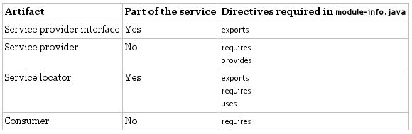

### Concurrency

1. Disk and network operations are extremely slow compared to CPU operations. Multithreaded processing is used by modern operating systems to allow applications to execute multiple tasks at the same time, which allows tasks waiting for resources to give way to other processing requests. Java has traditionally supported multithreaded programming using the **Thread** class. The **Concurrency** API has grown over time to provide numerous classes for performing complex thread-based tasks.

1. A thread is the smallest unit of execution that can be scheduled by the operating system. A process is a group of associated threads that execute in the same, shared environment. A **task** is a single unit of work performed by a thread. 

1. A process model is shown below:
	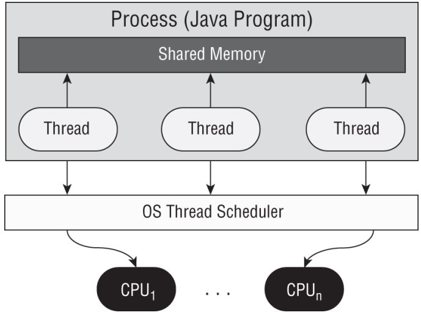

1. Thread types include **system threads** threads created by the JVM, and **user-defined** threads which are created by the application developer. Operating systems use a **thread scheduler** to determine which threads should be executing. A **context switch** is the process of storing a thread's current state and later restoring the state of the thread to continue executing. A thread can interrupt or supersede another thread if it has a higher **thread priority**.

1. The *java.lang.Runnable* interface is a functional interface that takes no arguments and returns no data. It is commonly used to define the task or work that a thread will execute, separate from the main application thread. The definition of runnable is shown below:
	```java
	@FunctionalInterface 
	public interface Runnable {
		void run();
	}
	```

1. To execute a thread first you define an instance of *java.lang.Thread*, and then you start the task using the *Thread.start()* method. Examples of defining a thread are shown below:
	```java
	// Providing a Runnable object to the Thread constructor
	public class PrintData implements Runnable{
		@Override public void run() {
			for(int i = 0; i < 3; i++)
				System.out.println("Printing record: "+i);
		}

		public static void main(String[] args){
			(new Thread(new PrintData())).start();
	}

	// Creating a class that extends Thread and overrides the run() method
	public class ReadInventoryThread extends Thread{
		@Override public void run() {
			System.out.println("Printing zoo inventory");
		}

		public static void main(String[] args){
			(new ReadInventoryThread()).start();
		}
	}
	```

1. While threads operate asynchronously, one thread may need to wait for the results of another thread. In such a case the *Thread.sleep()* method can be used to make a thread pause until results are ready. An example is shown below:
	```java
	class CheckResults {
	    private static int counter = 0;
	
	    public static void main(String[] a) throws InterruptedException {
		new Thread(() -> {
		    for (int i = 0; i < 500; i++) {
			CheckResults.counter++;
		    }
		}).start();
		while (CheckResults.counter < 100) {
		    System.out.println("Not reached yet");
		    Thread.sleep(1000); // 1 SECOND
		}
		System.out.println("Reached!");
	    }
	}
	```

1. To improve on the above and to assist with creating and managing threads, the *ExecutorService* interface in the Concurrency API can be used.

1. An example of using *newSingleThreadExecutor()* is shown below:
	```java
	import java.util.concurrent.*;
	public class ZooInfo{
		public static void main(String[] args){
		    ExecutorService service = null;
			Runnable task1 = () ->
				System.out.println("Printing zoo inventory");
			Runnable task2 = () -> {for(int i = 0; i < 3; i++)
				System.out.println("Printing record: "+i);};

			try{
				service = Executors.newSingleThreadExecutor();
				System.out.println("begin");
				service.execute(task1);
				service.execute(task2);
				service.execute(task1);
				System.out.println("end");
			} finally {
				if(service != null) service.shutdown();
			}
		}
	}
	```

1. If the *shutdown()* method is not called then the application will never terminate. As part of shutdown the thread executor rejects any new tasks submitted to the thread executor while continuing to execute any previously submitted tasks. The *isShutdown()* and *isTerminated()* methods can be used to check the status of the thread. The *shutdownNow()* method attempts to stop all running tasks immediately.

1. Tasks can be submitted to an *ExecutorService* in multiple ways. The *execute()* method is inherited from the *Executor* interface, which the *ExecutorService* interface extends. It is considered a "fire-and-forget" method as once it is submitted the result is not directly available to the calling thread. The *submit()* method returns a *Future* instance that can be used to determine whether the task is complete.

1. Useful *ExecutorService* methods are shown below:
	```java
	void execute(Runnable command);
	Future<?> submit(Runnable task);
	<T> Future<T> submit(Callable<T> task);
	<T> List<Future<T>> invokeAll(Collections<? extends Callable<T>> tasks) throws InterruptedException;
	<T> T invokeAny(Collection<? extends Callable<T>> tasks) throws InterruptedException, ExecutionException;
	```

1. To improve on the previous CheckResults implementation and avoid managing threads directly, the below implementation using *submit()* to return a *Future* object can be used: 
	```java
	public class CheckResults {
	    private static int counter = 0;
	
	    public static void main(String[] unused) throws Exception {
		ExecutorService service = null;
		try {
		    service = Executors.newSingleThreadExecutor();
		    Future<?> result = service.submit(() -> {
			for (int i = 0; i < 500; i++) {
			    CheckResults.counter++;
			}
		    });
		    result.get(10, TimeUnit.SECONDS);
		    System.out.println("Reached!");
		} catch (TimeoutException e) {
		    System.out.println("Not reached in time");
		} finally {
		    if (service != null) {
			service.shutdown();
		    }
		}
	    }
	}
	```

1. The *java.util.concurrent.Callable* functional interface is similar to *Runnable* except that its *call()* method returns a value and can throw a checked exception. The definition of the *Callable* interface is shown below:
	```java
	@FunctionalInterface
	public interface Callable<V> {
		V call() throws Exception;
	}
	```

1. The *Callable* interface is often preferable over *Runnable* since it allows more details to be retrieved easily from the task after it is completed.

1. After submitting tasks to a thread executor, it is common to wait for the results. An example is shown below for a  simple generic pattern where the result from the thread executor doesn't need to be retained: 
	```java
	ExecutorService service = null;
	try {
	    service = Executors.newSingleThreadExecutor();
	    // Add tasks to the thread executor
	} finally {
	    if (service != null) {
		service.shutdown();
	    }
	}
	if (service != null) {
	    service.awaitTermination(1, TimeUnit.MINUTES);
	    // Check whether all tasks are finished
	    if (service.isTerminated()) {
		System.out.println("Finished!");
	    } else {
		System.out.println("At least one task is still running");
	    }
	}
	```